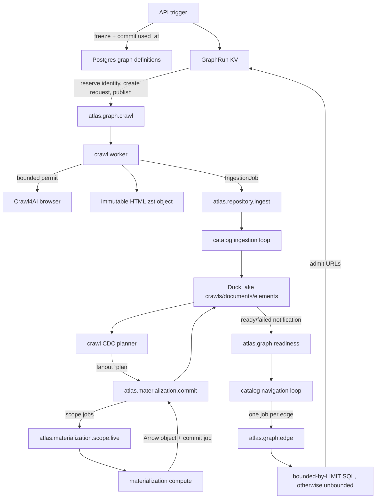
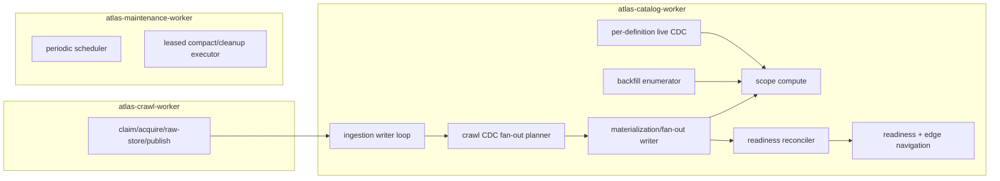

# Atlas post-refactor engineering audit

Date: 2026-07-12

Scope: repository-wide, read-only engineering audit of the graph cutover. No implementation fixes were made.

## 1. Executive summary

Atlas now has one visible product execution model: Postgres definitions, NATS current execution, immutable raw objects, and DuckLake evidence joined by crawl-scoped SQL edges. The old task/action HTTP and source-code execution paths are gone. The storage ownership model is mostly coherent, raw HTML handling is strong, graph snapshots are explicit, acquisition permits are released before catalogue work, and three deployables already express the right broad resource split: crawl, catalog, and maintenance.

That is not yet an operationally safe graph runtime. Correctness confidence is **low** and production-readiness confidence is **low**. The highest-risk state machines fail their own at-least-once assumptions: a crawl worker crash leaves a request in `crawling` and the redelivery is acknowledged; admission can reserve an identity without creating or publishing work and has no reconciler; acquisition failures can later be reported as successful requests; concurrent catalog redeliveries have no operation lease or commit fence; stale materialization jobs can leave a frozen fan-out permanently planned; and requeued materializations cannot reopen the terminal request they are meant to recover. A one-line `NameError` also crashes live/backfill publication and, through the catalog supervisor, stops ingestion and navigation.

The graph refactor is therefore **source-cut complete but runtime-cut incomplete**. `docs/TWO_WORKER_ARCHITECTURE_PLAN.md` specifies operation leases, PostgreSQL advisory fencing, integrated `page_links`, pressure backpressure, safe maintenance drain, final queue names, and failure injection. None of those core protections is implemented. `docs/ARCHITECTURE.md` describes parts of that target as current behavior, while `docs/CRAWL_GRAPHS.md` still labels the cutover incomplete. The disagreement is substantive, not editorial.

The worker-topology recommendation is **hybridize, not fully collapse**:

- Keep three deployables: independently scalable crawl workers, catalog workers, and one off-path maintenance worker.
- Keep durable handoffs for acquisition-to-ingestion, materialization compute-to-commit, expensive materialization work, edge evaluation, and maintenance.
- In the catalog role, plan the crawl's frozen fan-out with base ingestion, make readiness a verified durable-state continuation rather than a correctness-bearing notification queue, and keep one explicitly fenced DuckLake write authority per operation without requiring a separate repository deployment.
- Do not let crawl workers wait on or independently write DuckLake. Slow commits and materializations would consume browser capacity and create severe head-of-line blocking.

The smallest coherent simplification removes **one durable readiness queue/consumer and approximately two logical roles** (the CDC-only crawl fan-out planner and notification-only readiness processor) while retaining all three deployables and the necessary durable stages. Stream consolidation may reduce five work streams to three, but that is operational packaging, not removal of logical durability boundaries.

Finding count: **P0 0, P1 12, P2 12, P3 4 (28 total)**.

## 2. System map

### Implemented graph flow



The crawl permit covers only browser acquisition (`backend/actions/crawl/service.py:804-813`) and is released before raw storage and ingestion publication (`backend/actions/crawl/service.py:836-853`). Slow DuckLake work therefore does not directly hold browser permits. The crawl worker does, however, keep one of its own handler-concurrency slots until raw storage and the ingestion PubAck finish (`backend/workers/crawl.py:91-119`).

### Deployable and logical worker topology



`workers/catalog.py:25-29` starts ingestion, materialization, and navigation as sibling tasks. Any sibling exit cancels the other two (`workers/catalog.py:31-42`), so these are one deployment and one failure domain even though they use several queues and connections.

### State ownership

| State | Actual authority | Notes |
|---|---|---|
| Graphs, nodes, edges, policies, matches, catalogue definitions | Postgres | Correct broad ownership. Definition DDL also causes direct API DuckLake writes. |
| Runs, request state, dedupe, edge evaluations, projections, worker presence | NATS KV | Edge evaluations share the request bucket. Runs embed an ever-growing dedupe tuple. |
| Work and dead letters | NATS JetStream | Eight logical durable work queues plus two DLQ streams. |
| Raw HTML and materialization staging | disk/S3 repository objects | Relative keys and conditional creates are correctly enforced. |
| Crawls, documents, elements, materialized facts, coverage and fan-out | DuckLake | Correct durable evidence authority. |
| DOM preparation staging | catalog-worker local filesystem | Safe because paths do not cross processes; abandoned files rely on maintenance cleanup. |
| Progress/metrics | NATS projections and Prometheus | Progress is non-authoritative, appropriately, but transition failures can currently abort authoritative operations. |

### NATS inventory

| Stream/bucket | Subject/consumer | Protected invariant or purpose | Assessment |
|---|---|---|---|
| `ATLAS_GRAPH_WORK` | crawl / `atlas-graph-crawl-workers` | Per-URL acquisition delivery | Essential, but claim recovery is broken. |
| `ATLAS_GRAPH_WORK` | readiness / `atlas-graph-readiness-workers` | Wake navigation after durable fan-out | Accidental correctness dependency; replace with verified state continuation. |
| `ATLAS_GRAPH_WORK` | edge / `atlas-graph-edge-workers` | Retry/backpressure for potentially expensive edge SQL | Essential until edge execution is bounded and restartable. |
| `atlas_graph_runs` | KV | Run snapshot, counts, dedupe | Essential; dedupe representation is not scalable. |
| `atlas_crawl_requests` | KV | Request and edge-evaluation current state | Essential; separate edge prefix is only a naming convention. |
| `atlas_graph_workers` | KV TTL | Crawl presence/capacity | Useful operational projection. |
| `atlas_graph_progress` | KV | UI projection | Useful but non-authoritative. |
| `ATLAS_REPOSITORY` | ingest / `atlas-repository-writer` | Releases acquisition, isolates DOM/write load, survives death | Essential. |
| `ATLAS_REPOSITORY_RESULTS` | KV TTL | Frozen job and terminal ingestion result | Currently needed for ambiguous publish/submit recovery; should be simplified only after a state-driven ingest contract exists. |
| repository DLQ | limits stream | Terminal ingestion recovery | Essential. |
| materialization scopes | live and backfill consumers | Isolates CPU/memory and priority classes | Essential logical queues. |
| materialization commits | one commit consumer | Preserves staged compute across death and funnels writes | Essential durable boundary. Fan-out planning is an avoidable extra message type on it. |
| materialization DLQ | limits stream | Terminal scope recovery | Essential, but graph recovery is broken. |
| maintenance work | wildcard consumer | Off-path, independently retried upkeep | Essential. |
| maintenance workers/operations/lease | three KV buckets | Presence, idempotency, global exclusion | Conceptually essential; current lease is not a fence. |

Current logical durable work queues: **8** (crawl, readiness, edge, ingest, live scope, backfill scope, materialization commit, maintenance). Current deployables: **3**. Current logical roles: approximately **10**. Current DuckLake write-capable authorities: catalog ingestion/materialization connections, maintenance, setup, and API definition-DDL connections; horizontally scaled catalog processes can add more.

### Intended-versus-implemented differences

The worker plan's final `ATLAS_CRAWL_WORK`/`ATLAS_CATALOG_WORK` streams, catalog operation KV, advisory locks, pressure KV, integrated `page_links`, transaction retry settings, in-flight maintenance drain, HTTP transport, stage timestamps, and worker-presence state are absent (`docs/TWO_WORKER_ARCHITECTURE_PLAN.md:490-547`, `:551-644`, `:846-883`). The implementation instead retains `ATLAS_GRAPH_WORK`, `ATLAS_REPOSITORY`, separate scope/commit streams, and CDC fan-out (`backend/runtime/graph_queue.py:19-29`; `backend/repository/ingestion/queue.py:38-43`; `backend/materialization/queue.py:18-28`).

## 3. Findings

Findings are ordered by severity and expected risk reduction. Each fix is the smallest coherent correction, not a compatibility path.

### COR-001 — P1 — Claimed crawl work is unrecoverable after worker death

- **Confidence:** high.
- **Evidence:** claiming changes `queued` to `crawling` in KV before acquisition (`backend/workers/crawl.py:52-66`). A redelivery whose request is not `queued` is acknowledged (`backend/workers/crawl.py:55-65`). There is no owner, lease, attempt, or stale-claim reconciler in `CrawlRequest` (`backend/runtime/graph_queue.py:55-69`).
- **Scenario / impact:** process death after line 62 and before terminal settlement leaves the request `crawling`; JetStream redelivers; another worker acks without work; `pending_request_count` never reaches zero. This violates at-least-once recovery and causes likely stuck runs.
- **Smallest fix:** add a revision-fenced claim with owner and expiry (or an operation lease keyed by request), let only the current owner transition it, and reclaim expired acquisition claims. Do not acknowledge a non-terminal stale claim merely because its status is not `queued`.
- **Proof tests:** kill before load, during load, after raw write, and after ingestion PubAck; verify one durable crawl and eventual terminal run with two workers.
- **Dependencies/sequencing:** first correctness phase; precedes topology work. **Atlas-only.**

### COR-002 — P1 — Admission reserves work before creation/publication with no reconciliation

- **Confidence:** high.
- **Evidence:** run CAS appends identities and increments both counts first (`backend/runtime/graph_runs.py:84-99`); request creation, progress update, and publication are three later operations (`:105-113`). The comment calls the state recoverable but no code scans reserved identities or queued KV entries for missing publication. Run creation repeats this per seed (`:117-123`).
- **Scenario / impact:** failure after run CAS can leave no request KV; failure after request create can leave no queue message; failure during the seed loop creates a partially published run. The deterministic identity is consumed and replay returns no/new work while the pending count remains positive.
- **Smallest fix:** make request KV the durable admission record with an explicit publication state, CAS-create it before accounting, and run a reconciler that republishes every non-terminal `queued` record lacking confirmed delivery. Derive or reconcile run counters from request transitions.
- **Proof tests:** inject failure after each CAS/create/progress/publish operation and ambiguous PubAck; concurrent identical seeds and edges must produce one logical request and eventual delivery.
- **Dependencies:** before ceiling/dedupe redesign. **Atlas-only.**

### COR-003 — P1 — Failed acquisitions can complete successfully

- **Confidence:** high.
- **Evidence:** acquisition exceptions become `CrawlPage(success=False)` (`backend/actions/crawl/service.py:804-834`) and are still persisted (`:836-853`). The worker checks only that `crawl_id == request.id`, then moves the request to `awaiting_materializations` regardless of `page.success` or durable errors (`backend/workers/crawl.py:99-119`). A zero-row `page_links` materialization can then produce readiness and completion.
- **Scenario / impact:** DNS, timeout, browser, or HTTP acquisition failure is retained as evidence but the graph request and possibly the run are reported `completed`, suppressing the required operator-visible error.
- **Smallest fix:** after durable publication, classify acquisition outcome from the frozen/durable record. Terminal acquisition failures must settle the request `failed`; only an explicit successful stale-cache fallback should continue.
- **Proof tests:** network exception, failed Crawl4AI result, empty HTML, HTTP error policy, and stale fallback; assert durable failure evidence plus `completed_with_errors`, not success.
- **Dependencies:** coordinate with ingest acknowledgement so failure evidence is durable before request failure. **Atlas-only.**

### MAT-001 — P1 — Live/backfill scope publication crashes the catalog worker

- **Confidence:** high; directly reproduced.
- **Evidence:** `publish_scope` constructs `job` but passes undefined `operation_id` as the message ID (`backend/materialization/definitions.py:60-70`). Both live CDC and backfill call it (`backend/materialization/live.py:74-82`; `backend/materialization/backfill.py:35-40`). The materialization TaskGroup propagates the exception (`backend/materialization/executor.py:58-69`), and the catalog supervisor cancels ingestion and navigation when any sibling exits (`backend/workers/catalog.py:31-42`).
- **Scenario / impact:** first document live change or backfill scope raises `NameError`; the whole catalog process exits, stopping ingestion, readiness, and edges.
- **Smallest fix:** publish with `job.operation_id`; add a contract test that reaches the publisher. No abstraction is needed.
- **Proof tests:** one live and one backfill job, including duplicate publication and supervisor survival.
- **Dependencies:** immediate standalone fix. **Atlas-only.**

### COR-004 — P1 — Duplicate catalog operations have no execution or commit fence

- **Confidence:** high for missing invariant; medium for the exact DuckLake conflict outcome.
- **Evidence:** consumers use at-least-once delivery, but there is no catalog operation KV/advisory lock. Ingestion resolves identities and writes inside a transaction (`backend/repository/catalogue/service.py:202-227`, `:291-338`) without a per-operation cross-process fence. Materialization checks coverage before its transaction (`backend/materialization/commit.py:43-69`, `:169-215`). The target explicitly requires a NATS lease plus PostgreSQL advisory lock (`docs/TWO_WORKER_ARCHITECTURE_PLAN.md:252-274`). Opt-in concurrent Postgres tests were skipped.
- **Scenario / impact:** ack heartbeat loss, long commit, or process pause permits overlapping delivery on two catalog replicas. Both can observe identity absent before either commits; duplicate crawl/document/coverage rows or incompatible retries are possible because DuckLake tables do not enforce application UUID uniqueness.
- **Smallest fix:** implement deterministic catalog operation lease and advisory commit fence, then resolve durable identity under the fence before write. Keep unrelated operations concurrent.
- **Proof tests:** 1/2/4 workers; duplicate delivery; death before/during/after commit; lost response; same and different operation IDs.
- **Dependencies:** before horizontal catalog scaling or worker consolidation. Potential **upstream measurement opportunity**, but the fence is Atlas-owned; no `UPSTREAM.md` change warranted.

### MAT-002 — P1 — Definition changes can strand frozen crawl fan-outs forever

- **Confidence:** high.
- **Evidence:** planning freezes member IDs/revisions (`backend/materialization/live.py:201-214`; `backend/repository/catalogue/fanout.py:18-70`). Compute rejects a no-longer-current definition (`backend/materialization/compute.py:28-45`); the executor treats that as stale and acks without coverage (`backend/materialization/executor.py:94-96`). The fan-out member remains `planned`; readiness requires every member to settle (`backend/repository/catalogue/fanout.py:72-136`).
- **Scenario / impact:** user rebuilds, edits, archives, or dematerializes after plan but before compute. The scope message disappears, no success/failure coverage exists, and the crawl/run waits forever.
- **Smallest fix:** either freeze executable SQL/schema in the scope job as the worker plan specifies, or atomically settle an obsolete member as an explicit terminal failure/cancellation that the graph can recover. Do not ack a frozen fan-out member without changing its authoritative state.
- **Proof tests:** change/archive definition at every boundary from plan through commit; zero missing planned members and visible recovery.
- **Dependencies:** before simplifying readiness. **Atlas-only.**

### MAT-003 — P1 — Dead-letter requeue cannot resume graph readiness

- **Confidence:** high.
- **Evidence:** failed readiness immediately calls terminal `settle_request` (`backend/runtime/graph_runs.py:171-178`). Terminal requests are absorbing (`:141-168`). A later successful requeue changes DuckLake coverage and emits a `ready` event, but readiness ignores terminal requests (`:172-174`). The design claims requeue resumes without reacquisition (`docs/CRAWL_GRAPHS.md:310-312`).
- **Scenario / impact:** operator repairs and requeues a failed materialization; evidence becomes valid but the source request/run remains failed. Recovery requires a new crawl, contrary to the durable-evidence contract.
- **Smallest fix:** represent enrichment failure as a recoverable terminal stage distinct from final request failure, or add an explicit CAS-fenced resume operation that reopens only the matching failed fan-out generation.
- **Proof tests:** terminal compute and commit failure, DLQ requeue to success, duplicate ready/failed notifications, and already-settled run reconciliation.
- **Dependencies:** state model change before UI/operator recovery claims. **Atlas-only.**

### COR-005 — P1 — Runtime trusts readiness payloads instead of DuckLake authority

- **Confidence:** high.
- **Evidence:** `handle_readiness` validates neither fan-out state nor crawl/run/request association; it trusts `status`, IDs, and `crawl_id` from the message and publishes edges (`backend/runtime/graph_runs.py:171-205`). The catalogue is available in the same navigation process but is not consulted (`backend/runtime/catalog_navigation.py:28-64`).
- **Scenario / impact:** stale, malformed, prematurely published, or mismatched internal notification can run edges before ingestion/fan-out completion or fail the wrong request. NATS becomes correctness state, contrary to the documented authority.
- **Smallest fix:** treat the message as a crawl ID wake-up only. Read and validate terminal fan-out plus crawl provenance from DuckLake, then perform a revision-fenced request continuation.
- **Proof tests:** forged/mismatched event, event before plan, zero-member plan, lost event, duplicate event, and failed-to-ready recovery.
- **Dependencies:** naturally enables deletion of readiness queue later. **Atlas-only.**

### OPS-001 — P1 — Maintenance lease does not fence catalog writes

- **Confidence:** high.
- **Evidence:** catalog loops only check whether the lease key exists before starting a loop iteration (`backend/repository/ingestion/worker.py:115-123`; `backend/materialization/executor.py:74-87`). Maintenance acquires the lease and immediately compacts/cleans (`backend/workers/maintenance.py:93-122`); it never waits for in-flight commits. `ATLAS_MAINTENANCE_CATALOG_DRAIN_SECONDS` is defined but unused (`backend/config/environment.py:115`). Lease-heartbeat failure is not monitored while the operation continues (`backend/workers/maintenance.py:54-66`, `:114-136`).
- **Scenario / impact:** maintenance begins while a catalog transaction already runs, or its lease expires after heartbeat failure and catalog work resumes while maintenance continues. This violates the intended exclusion and can create DuckLake maintenance/write races.
- **Smallest fix:** catalog workers publish active operation state and recheck lease before commit; maintenance waits for a verified drain, aborts on lease-heartbeat loss, and only then mutates. Keep maintenance separately deployable.
- **Proof tests:** long catalog commit overlapping lease acquisition, heartbeat loss, maintenance worker death, lease expiry, and two maintenance replicas.
- **Dependencies:** before automating any retention/repair. **Atlas-only.**

### EDGE-001 — P1 — Edge SQL is not operationally bounded and blocks navigation

- **Confidence:** high.
- **Evidence:** validation requires one `$crawl_id`, a projected `url`, and outer literal `LIMIT` (`backend/control/crawl_graphs/service.py:237-260`). Execution has no timeout, scanned-byte, output-byte, or per-query memory bound (`backend/repository/catalogue/query.py:162-180`). `_edge_urls` synchronously opens DuckDB and iterates Arrow batches inside the async navigation task (`backend/runtime/catalog_navigation.py:28-37`), and edge messages have no ack heartbeat (`:52-67`).
- **Scenario / impact:** an expensive join/DOM helper can scan unbounded history despite `LIMIT`, block all readiness/edge tasks in that event loop, exceed the 60-second ack wait, and run concurrently after redelivery. One pathological crawl can block unrelated navigation.
- **Smallest fix:** execute edge SQL in a bounded worker thread/process with DuckDB memory and timeout/interrupt controls, enforce streamed row and byte ceilings, heartbeat or lease the operation, and keep a durable edge queue for isolation.
- **Proof tests:** slow query, huge URL strings, expensive pre-limit scan, timeout, cancellation, redelivery, and mixed cheap/pathological workload.
- **Dependencies:** before considering direct edge calls. **Atlas-only;** if DuckDB interruption proves awkward, record a concrete `ducklake-client` need then.

### LIFE-001 — P1 — Run duration and stuck-state recovery are not active mechanisms

- **Confidence:** high.
- **Evidence:** the wall-duration check runs only during new admission (`backend/runtime/graph_runs.py:59-66`, `:90-102`). No sweeper, expiration worker, stale request reconciler, or runtime cleanup exists. Run/request/progress buckets have no runtime TTL (`backend/runtime/graph_queue.py:183-212`).
- **Scenario / impact:** a last request stuck in crawling, ingestion, materialization, or edge evaluation receives no further admission, so the one-hour ceiling is never checked and the run remains active indefinitely.
- **Smallest fix:** add one state reconciler that enforces duration, repairs publish gaps/stale claims from authoritative state, and settles or explicitly fails irrecoverable work. Add bounded retention only after terminality.
- **Proof tests:** freeze time with one request in every non-terminal stage; restart reconciler; assert visible terminal status and cleanup after retention.
- **Dependencies:** combines well with COR-001/002; do not create another service. **Atlas-only.**

### PERF-001 — P1 — Run-level dedupe is quadratic and can exceed NATS payload limits before the advertised ceiling

- **Confidence:** high for scaling structure; medium for exact failure cardinality.
- **Evidence:** every admission performs tuple membership, copies the full tuple, and rewrites the whole `GraphRun` JSON (`backend/runtime/graph_runs.py:84-99`). Crawl/document modes can store both narrow and graph hashes. The advertised ceiling is 10,000 (`backend/config/environment.py:81`), while Compose uses default NATS payload settings (`docker-compose.yml:331-343`).
- **Scenario / impact:** cumulative work is O(n²) bytes and CPU. Up to 20,000 64-byte hashes plus JSON exceed a typical 1 MiB message before the 10,000-request ceiling; the run CAS fails, leaving admission partially reserved or stuck.
- **Smallest fix:** move dedupe identities to individual KV keys (or deterministic request/admission records) and keep bounded counters in `GraphRun`. Use CAS create for uniqueness; never rewrite the full seen set.
- **Proof tests:** 10,000 graph/crawl/document admissions, concurrent duplicates, NATS max-payload boundary, and state-retention cleanup.
- **Dependencies:** implement with COR-002. **Atlas-only.**

### COR-006 — P2 — Graph freezing is not fully race-safe or database-enforced

- **Confidence:** medium-high.
- **Evidence:** `freeze_graph` row-locks the graph, but `selectinload` component reads are separate and component rows are not locked (`backend/control/crawl_graphs/service.py:82-90`, `:206-218`). Node/edge edits lock only their component (`:128-133`, `:186-197`), so their lock order and protected rows differ. The root FK references node ID alone (`backend/control/crawl_graphs/models.py:24-26`), unlike composite edge FKs.
- **Scenario / impact:** concurrent edit/delete/freeze can snapshot values while another transaction has already passed its `used_at is null` check; direct SQL can assign a cross-graph root. Application tests use SQLite and do not exercise Postgres locking.
- **Smallest fix:** lock graph then all included node/edge rows in a consistent order during freeze and mutations; add a composite `(graph_id, root_node_id)` invariant in Postgres.
- **Proof tests:** Postgres concurrent freeze/update/delete/root changes with barriers.
- **Dependencies:** schema reset is acceptable greenfield. **Atlas-only.**

### COR-007 — P2 — URL identity uses two normalizers

- **Confidence:** high.
- **Evidence:** runtime identity removes default ports but preserves query order (`backend/runtime/graph_queue.py:120-152`); acquisition/control normalization sorts query parameters and preserves lowercased netloc (`backend/control/url_matching.py:65-81`). Both are used in one lifecycle (`backend/runtime/graph_runs.py:71-81`; `backend/actions/crawl/service.py:632-639`).
- **Scenario / impact:** `?a=1&b=2` and `?b=2&a=1` are distinct admissions but the same acquisition/cache identity, producing duplicate crawl work and ambiguous user expectations.
- **Smallest fix:** define one typed canonical URL function for admission, policy matching, crawl input hash, and edge outputs; document whether query order is semantic.
- **Proof tests:** default ports, fragments, query ordering/repetition/blanks, Unicode/IDNA, IPv6, percent encoding.
- **Dependencies:** changes runtime identity; reset disposable NATS state. **Atlas-only.**

### COR-008 — P2 — Cancellation settles the run but not its requests

- **Confidence:** high.
- **Evidence:** `request_cancellation` accepts `requests` but never uses it and immediately marks the run cancelled (`backend/runtime/graph_runs.py:126-138`). Queued crawl messages eventually cancel themselves, but readiness returns early for a terminal run without settling awaiting requests (`:171-181`).
- **Scenario / impact:** cancelled runs retain non-terminal request and edge state, pending counts, and misleading progress; work notifications continue to churn.
- **Smallest fix:** cancellation sets a run intent, prevents admission, and a bounded reconciler CAS-cancels every non-terminal child; final run settlement follows child terminality or explicitly records abandoned counts.
- **Proof tests:** cancel in every stage, multiple edges, concurrent settlement, repeated cancel.
- **Dependencies:** reuse lifecycle reconciler. **Atlas-only.**

### COR-009 — P2 — Edge evaluation status is not a claim

- **Confidence:** high.
- **Evidence:** any delivery changes `pending` or `failed` to `running`, but an already `running` evaluation is also executed (`backend/runtime/graph_runs.py:220-248`). There is no owner/revision lease; progress checkpoints can be applied by overlapping deliveries (`:256-292`).
- **Scenario / impact:** ack expiry or delayed worker causes two full queries, doubled progress, competing failure/completion, and unnecessary admission calls. Deterministic target IDs limit duplicate requests but not cost or status races.
- **Smallest fix:** use the catalog operation lease/fence for edge execution and allow expired-owner takeover only.
- **Proof tests:** overlapping redelivery, one evaluator fails while another succeeds, stale writer after lease steal.
- **Dependencies:** COR-004. **Atlas-only.**

### ARC-001 — P2 — The documented two-worker cutover is materially incomplete

- **Confidence:** high.
- **Evidence:** target operation lease/backpressure/final streams and responsibilities are explicit (`docs/TWO_WORKER_ARCHITECTURE_PLAN.md:237-290`, `:490-547`, `:846-883`). Actual queue names and state are the older split (`backend/runtime/graph_queue.py:19-29`; `backend/materialization/queue.py:18-28`). `page_links` remains a generic CDC materialization (`backend/control/catalogue_views/system.py:61-101`) rather than ingestion-owned evidence.
- **Scenario / impact:** operators and developers reason from guarantees that do not exist; navigation-critical `page_links` competes with user materializations and extra CDC/queue hops.
- **Smallest fix:** after correctness fencing, finish the narrow target: integrate `page_links` and fan-out planning into base ingestion, introduce operation fencing/backpressure, then delete superseded streams directly. Alternatively update the target document if evidence rejects a piece; do not leave both as “current.”
- **Proof tests:** target matrix in the plan, especially concurrent writers and crash points.
- **Dependencies:** correctness first. **Atlas-only.**

### ARC-002 — P2 — Scheduling is documented and depended upon but not implemented

- **Confidence:** high.
- **Evidence:** architecture assigns schedules to Postgres and graph triggering (`docs/ARCHITECTURE.md:5-16`, `:61-67`); runtime types include `scheduled` (`backend/runtime/graph_queue.py:31-33`). There are no schedule models, routes, worker, or frontend; `croniter` is a dependency with no caller (`backend/pyproject.toml:10`).
- **Scenario / impact:** a stated lifecycle entry point does not exist; unused dependency and trigger enum imply false completeness.
- **Smallest fix:** either remove schedule claims, enum branch, and `croniter` until an active caller exists, or implement schedules as thin Postgres inputs to the same trigger transaction. No separate execution model.
- **Proof tests:** only required if schedules remain: concurrent firing, freeze semantics, missed-fire policy, idempotent run creation.
- **Dependencies:** product decision. **Atlas-only.**

### ARC-003 — P2 — API definition mutations write DuckLake outside the claimed catalog/maintenance coordination

- **Confidence:** high for contract drift; medium for observed failure severity.
- **Evidence:** API view/materialization mutations create local catalogue connections and execute DuckLake DDL (`backend/api/routers/catalogue_views.py:55-104`; `backend/api/routers/catalogue_materializations.py:69-133`). The worker target says the API never writes DuckLake (`docs/TWO_WORKER_ARCHITECTURE_PLAN.md:843-844`). These API writes do not observe the maintenance lease.
- **Scenario / impact:** live DDL can race maintenance and catalog CDC/compute, crossing schema boundaries outside the documented write authority.
- **Smallest fix:** decide the real boundary. Prefer a catalog control-operation queue for DDL that must coordinate with writers, while Postgres remains the definition authority; or explicitly document and fence API DDL if synchronous UX is required.
- **Proof tests:** view replace/materialization rebuild concurrent with scope compute, commit, and maintenance.
- **Dependencies:** after operation/maintenance fencing. **Atlas-only.**

### PERF-002 — P2 — No catalogue-lag backpressure exists

- **Confidence:** high.
- **Evidence:** crawl workers fetch solely from local handler availability (`backend/workers/crawl.py:180-198`). The planned pressure KV and thresholds are absent; only repository queue metrics are emitted (`backend/repository/ingestion/worker.py:125-138`).
- **Scenario / impact:** sustained acquisition can outpace DOM/materialization/edge work until JetStream, object storage, and current-state buckets fill; raw storage continues even while navigation is unusably delayed.
- **Smallest fix:** after measuring queue ages, implement one catalog-pressure projection consumed by crawl claiming. Do not hold browser permits or add a global semaphore.
- **Proof tests:** slow catalog with fast acquisition, dependency outage, stale/missing pressure state, recovery without thundering herd.
- **Dependencies:** metrics first; target thresholds require benchmark validation. **Atlas-only.**

### PERF-003 — P2 — Catalog concurrency configuration does not bound all catalog workloads coherently

- **Confidence:** high.
- **Evidence:** navigation uses `ATLAS_CATALOG_WORKER_CONCURRENCY` but synchronous query work blocks its event loop (`backend/runtime/catalog_navigation.py:82-105`). Scope compute is a single sequential consumer (`backend/materialization/executor.py:74-104`). Ingestion and materialization commit share a loop that checks one commit then may block on ingest fetch (`backend/repository/ingestion/worker.py:115-145`).
- **Scenario / impact:** the configured value suggests parallel catalog capacity that does not exist uniformly; slow compute or edge SQL creates head-of-line blocking and priority inversion.
- **Smallest fix:** define separate bounded pools inside one catalog deployable for ingestion preparation, materialization compute, edge query, and serialized/fenced commit; retain priority and shared memory ceiling.
- **Proof tests:** mixed tiny/large HTML, cheap/expensive materializations and edges; verify bounded memory and latency isolation.
- **Dependencies:** benchmark before pool sizes. **Atlas-only.**

### DX-001 — P2 — CrawlPolicy is neither strongly validated nor engine-neutral

- **Confidence:** high.
- **Evidence:** policy `config` is arbitrary JSON and only nested cache options are validated (`backend/control/crawl_policies/schemas.py:65-76`). Acquisition reads untyped `mode`, `wait`, and `run_config_overrides` (`backend/actions/crawl/service.py:561-573`). The durable `CrawlRecord` imports `crawl4ai.utils.get_base_domain` (`backend/repository/catalogue/records.py:11`, `:69-94`), and the worker always constructs a Crawl4AI browser with app-mode browser config (`backend/workers/crawl.py:178-179`).
- **Scenario / impact:** invalid policy fails at runtime; Crawl4AI-specific config leaks into frozen policy/evidence; a second engine would require touching policy parsing, worker lifecycle, and repository records.
- **Smallest fix:** type the currently supported acquisition settings and add one visible `engine` discriminator only when adding engine two. Dispatch in the crawl acquisition module to two concrete adapters returning the existing engine-neutral `CrawlPage`; move registrable-domain calculation to an engine-neutral library. Do not add registry/factory/plugin layers.
- **Proof tests:** frozen policy round-trip, unsupported engine, invalid engine-specific options, same repository result contract across two fake engines.
- **Dependencies:** no need to block correctness fixes. **Atlas-only.**

### OBS-001 — P2 — Observability cannot locate most stuck stages

- **Confidence:** high.
- **Evidence:** request stores only one `updated_at` and error (`backend/runtime/graph_queue.py:55-69`). The planned first-entered stage timestamps and catalog operation metrics are absent. Catalog presence is not published; health is mostly ingestion-loop health. Progress KV is current counters, not stage history (`backend/runtime/graph_progress.py:51-90`).
- **Scenario / impact:** operators cannot distinguish queue wait, acquisition, raw write, ingestion, fan-out planning, scope compute, commit, readiness, or edge delay; topology decisions cannot be evidence-based.
- **Smallest fix:** persist bounded stage timestamps/attempt/owner in current request and operation state; export queue oldest age, commit conflicts, readiness lag, duplicates recovered, and per-stage durations.
- **Proof tests:** metrics emitted once under retry and not used as correctness state.
- **Dependencies:** align with new state machines. **Atlas-only.**

### TEST-001 — P2 — Tests prove happy-path helpers, not distributed invariants

- **Confidence:** high.
- **Evidence:** graph runtime tests use in-memory fakes and serial calls (`backend/tests/test_graph_runtime.py:83-197`); graph locking tests use SQLite (`backend/tests/test_crawl_graphs.py:35-42`). No source test calls `publish_scope`, allowing MAT-001. The full suite skipped both Postgres concurrency and both MinIO tests. There are no worker crash-point, ambiguous publish, stale lease, cancellation-stage, failed-acquisition, or materialization-resume tests.
- **Scenario / impact:** 125 tests pass while multiple guaranteed crash/recovery paths fail.
- **Smallest fix:** prioritize the failure-injection matrix in section 8; delete or rewrite tests that merely assert obsolete route absence once stronger OpenAPI snapshots exist.
- **Proof tests:** this finding is the test plan itself.
- **Dependencies:** required before topology changes. **Atlas-only.**

### DOC-001 — P3 — Architecture documents disagree about current state

- **Confidence:** high.
- **Evidence:** `docs/CRAWL_GRAPHS.md:3-5` says cutover incomplete; `docs/ARCHITECTURE.md:94-104` describes catalog workers as if concurrent retry/readiness guarantees exist; the worker plan declares final queues that do not exist. `.env.example:24-31` still says Compose starts required Quack, while Compose has no Quack service.
- **Scenario / impact:** misleading operating and development decisions.
- **Smallest fix:** mark target versus implemented contracts explicitly, then update all three atomically with the completed hard cut.
- **Proof tests:** documentation link/config-name check. **Atlas-only.**

### DEL-001 — P3 — Superseded configuration and dependency remnants remain

- **Confidence:** high.
- **Evidence:** stale Quack variables in `.env.example:24-31`; stale Quack Docker comment (`docker/atlas/Dockerfile:18`); unused `croniter` (`backend/pyproject.toml:10`); unused `ATLAS_CRAWL_WORKER_POLL_SECONDS`, `ATLAS_MAINTENANCE_CATALOG_DRAIN_SECONDS`, and request status `awaiting_ingestion` (declared at `backend/runtime/graph_queue.py:32`, never entered).
- **Scenario / impact:** false knobs and concepts increase deployment and debugging cost.
- **Smallest fix:** delete unused settings/dependency/status and stale prose in one cleanup after any schedule decision.
- **Proof tests:** configuration-use inventory and startup validation. **Atlas-only.**

### DEL-002 — P3 — Ignored compiled pre-graph artifacts obscure audits and checks

- **Confidence:** high.
- **Evidence:** the workspace contains ignored `__pycache__` files for deleted task/action/runtime modules and empty legacy directories. `make check`'s compile listing showed `actions/search`, `actions/index`, and `control/tasks` despite no source files.
- **Scenario / impact:** audit/search noise and misleading validation output; these are not active imports from `__pycache__`, so severity is low.
- **Smallest fix:** delete ignored caches/empty dirs locally and ensure clean/test commands remove them. Do not add source compatibility stubs.
- **Proof tests:** source-only file inventory. **Atlas-only.**

### DX-002 — P3 — CLI does not expose graph operations

- **Confidence:** high.
- **Evidence:** CLI registers only repository administration (`backend/cli/app.py:5-10`), while API and frontend own graph CRUD/run operations.
- **Scenario / impact:** automation and failure administration require raw HTTP or UI, weakening dogfooding and reproducible operations.
- **Smallest fix:** add thin graph/run commands only when an active operator caller is confirmed; reuse API contracts, no domain logic.
- **Proof tests:** API error propagation and exact payloads. **Atlas-only.**

## 4. Deletion plan

1. **Immediate source/config cleanup:** remove stale Quack `.env.example` block and Docker comment, unused `croniter` if schedules remain out of scope, unused environment keys, dead `awaiting_ingestion`, stale “task run” comments in policy/UI, ignored caches, and empty legacy directories. Active callers: none, except product decision around scheduling.
2. **After base-ingestion fan-out cut:** delete the crawl CDC fan-out planner and `fanout_plan` commit message type. Ingestion must atomically commit the crawl, system `page_links`, frozen fan-out, and membership before these callers move.
3. **After durable-state readiness cut:** delete `atlas.graph.readiness`, its consumer, `ReadinessWork` as a correctness payload, and notification choreography. Keep a state reconciler that scans terminal/unadvanced fan-outs and directly advances request state.
4. **After integrated `page_links`:** remove the system `CatalogueMaterialization` for `page_links`, its backfill/live scope work, and related setup assumptions. Keep the stable table/view name; reset disposable DuckLake state rather than dual-writing.
5. **After ingestion state redesign:** remove per-job `reply_subject`, inbox notifications, and polling wake-up complexity if the caller can await/watch durable operation state. Do not remove the durable ingestion queue or frozen job before publish-gap recovery exists.
6. **Queue packaging:** after all publishers/consumers move, delete old streams directly and recreate the target crawl/catalog/maintenance streams. Stream count can shrink without pretending that materialization compute, commit, edge, and maintenance no longer need independent durable semantics.

No committed task/action execution source, API routes, or frontend screens remain to delete. The remaining `actions/` name contains the active crawl implementation and quality/cache helpers; renaming is optional and lower value than correcting state machines.

## 5. Dynamic crawling-engine readiness

Current coupling is concentrated enough to fix without a framework, but not yet clean: the worker owns `AsyncWebCrawler`, shared config exposes Crawl4AI `BrowserConfig`/`CrawlerRunConfig`, arbitrary policy JSON is passed into those types, and the repository record imports a Crawl4AI URL helper.

Shared engine-neutral concepts should remain: normalized request URL, cache policy, acquisition timeout/retry/header intent, per-worker and per-policy capacity, `CrawlPage`, raw HTML identity, durable provenance, and ingestion publication. Engine-specific browser/run configuration should remain inside the Crawl4AI implementation.

The minimal future seam is:

```text
CrawlPolicy.engine: crawl4ai | second_engine
acquire(request, typed_engine_options, shared_limits) -> CrawlPage
```

Use one explicit conditional in `actions/crawl/` when engine two is added. Give each engine a concrete lifecycle owned by the crawl worker. Do not add a registry, factory hierarchy, plugin protocol, or provider DTO stack. Tests should run the same normalization, permit, failure, raw-object, and provenance contract against fake implementations of both concrete engines. Worker consolidation does not help this seam; coupling acquisition to DuckLake/materialization would make it worse.

## 6. Worker-topology simplification

### Decision

**Recommendation: hybridize. Confidence: high on retaining the resource split; medium on the exact internal queue count until benchmarks.**

1. **Could one runtime worker safely own the entire lifecycle?** Only by internally retaining separate bounded pools, durable state transitions, and a fenced writer—in other words, one binary, not one synchronous unit. Current code cannot safely do it.
2. **Should it?** No. Browser acquisition is remote-I/O and Chromium-memory bound; DOM/materialization/edge work is CPU/query-memory bound; DuckLake commits contend on metadata; maintenance needs global exclusion. Making one request handler await all stages would waste browser fleet capacity and create head-of-line blocking.
3. **Direct calls:** within the catalog deployable, base ingestion should directly plan/freeze fan-out in its transaction; terminal fan-out reconciliation can directly advance verified readiness; zero-member fan-out can directly enqueue edges.
4. **Durable boundaries to keep:** crawl acquisition, ingestion, scope compute, computed-result commit, edge evaluation, and maintenance. Scope compute-to-commit preserves expensive work and enforces writer ownership. Edge work remains durable because SQL can be slow and independently retried.
5. **One repository write authority without a separate deployment?** Yes. The catalog role already embeds ingestion and materialization writing. “One authority” should mean per-operation lease/advisory fence and controlled commit pool, not one global process. A single internal writer pool is a valid temporary constraint if benchmarks show concurrent DuckLake commits do not scale.
6. **Readiness simplification:** yes. Make it a DuckLake fan-out/crawl state check plus a NATS request CAS. A notification may remain a latency hint temporarily, but the queue can be deleted once reconciliation directly advances state.
7. **Necessary roles/queues:** three deployables; approximately seven durable logical queues after removing readiness. Two logical roles can disappear by folding fan-out planning into ingestion and readiness into state reconciliation.
8. **Simplest crash-safe design:** acquisition publishes frozen ingest; catalog preparation and fan-out commit under operation fence; scope compute stages durable object; commit writer records coverage/fan-out atomically; reconciler enqueues fenced edge work; edges admit via durable request records; maintenance drains/fences catalog commits.
9. **Resource isolation:** full collapse materially worsens it. Hybrid internal pools improve deployment simplicity without sharing browser, compute, and commit concurrency.
10. **Essential versus accidental:** essential are durable evidence, operation identity/fencing, acquisition release, compute/commit staging, edge retry, and maintenance exclusion. Accidental are CDC crawl planning after ingestion, readiness message choreography, reply inboxes, multiple stream containers for work that shares one deployable, and progress failures participating in domain control flow.

### Candidate comparison

| Option | Correctness | Throughput/isolation | Operational/DX cost | Decision |
|---|---|---|---|---|
| A. Current separated internals | Intended boundaries are sensible, implementation is not restart-safe | Browser isolation good; catalog HOL and no backpressure | Highest queue/state choreography | Do not retain unchanged. |
| B. One deployable role with internal stages | Can be correct only with all durable stages/fences | Couples scaling and failure of browser/catalog; one container can still use pools | Fewer deployables, harder capacity model | Reject as global deployment topology. Catalog already uses this pattern internally. |
| C. End-to-end runtime request | Crash gaps and writer concurrency become much worse | Slow storage/materialization consumes acquisition slots | Superficially simple, operationally dangerous | Reject. |
| D. Hybrid | Preserves durable handoffs and writer fence; removes notification/planner choreography | Independent crawl/catalog/maintenance scaling | Three clear deployables, fewer internal transitions | Recommend. |

### Crash analysis by durable operation

| Crash point | Required recovery |
|---|---|
| Before request KV | admission retry may create it; no run count consumed |
| After request KV, before crawl publish | reconciler republishes deterministic message |
| After crawl claim | expired owner reclaims; stale worker cannot settle |
| After raw object write | content address makes replay safe |
| After ingest PubAck, before request transition | ingest state/reconciler advances request without reacquisition |
| During catalog preparation | redelivery recomputes; local staging cleaned by grace period |
| After DuckLake commit, before result/ack | under advisory fence resolve compatible crawl/fan-out identity and acknowledge |
| After fan-out commit, before scope publish | scan planned members and republish deterministic jobs |
| After scope staging, before commit publish | scope redelivery verifies/reuses deterministic staging or recomputes |
| After materialization commit, before ack | resolve coverage operation identity; refresh fan-out once |
| After fan-out terminal, before edge publish | reconciler derives missing evaluations from durable fan-out and NATS snapshot |
| During edge query | lease expires; new owner reruns bounded query; deterministic admissions suppress duplicates |
| After target request create, before publish | admission reconciler publishes it |
| During maintenance | heartbeat loss aborts; TTL releases; operation record determines retry versus completed |

### Staged migration, no dual path

1. Fix acquisition/admission/catalog operation fencing and add failure injection on current names.
2. Integrate `page_links` and frozen fan-out into base ingestion; reset disposable DuckLake.
3. Replace readiness consumer with verified state-driven continuation; delete readiness subject/consumer.
4. Repackage remaining work into crawl/catalog/maintenance streams and delete old streams/KV in one runtime reset.
5. Add pressure feedback and tune internal pools from measurements. No indefinite dual publishers or compatibility aliases.

## 7. Performance plan

### Immediate evidence-backed corrections

- Replace run-level dedupe tuple with per-identity CAS keys; removes O(n²) writes and payload risk.
- Move blocking edge SQL off the async navigation loop and add hard query bounds.
- Fix `publish_scope`; otherwise all live/backfill throughput becomes zero and the catalog process exits.
- Integrate crawl fan-out and navigation-critical `page_links` with base ingestion, removing CDC discovery and at least two queue hops per crawl.
- Make catalog priority/pools explicit; current concurrency settings do not control all workloads.
- Add catalog-lag backpressure before increasing crawl replicas.

### Measurements needed for topology decisions

For representative small/median/p99 HTML and 0/1/8 materializations, record browser acquisition, raw compression/write, ingest queue wait, DOM preparation, DuckLake commit, fan-out planning, scope compute, scope commit, readiness, and edge latency. Count NATS publications, acknowledgements, KV reads/writes, and bytes per crawl. Run 1/2/4 catalog processes against Postgres DuckLake and S3, injecting duplicate delivery and after-commit death. Measure commit conflict rate, recovery time, duplicate preparation, memory per stage, and p95 latency under a 90% cheap / 10% pathological mixed workload.

Decision thresholds inherited from the target plan are reasonable starting gates, not current facts: catalog throughput at least 1.25x sustained acquisition; two catalog workers at least 1.6x one worker; conflict rate below 5%; p95 conflict retry below two seconds; p95 publication-to-navigation-ready below 30 seconds without growing oldest age.

### Likely future bottlenecks, not yet fixes

- DOM projection can reach one million elements and 256 MiB staged per document; measure before lowering limits.
- Materialization output is row/byte bounded but has no time bound; add timing before choosing per-class pools.
- Repeated `catalogue_from_env()` opens embedded connections for edges/backfill/readiness; measure attach/setup share before pooling more broadly.
- Inlining/compaction thresholds need Postgres growth and read-latency evidence. No permanent per-crawl files are present.
- The frontend build emits a 1.85 MB JS chunk (552 KB gzip); code-splitting is a real build warning but lower priority than runtime correctness.

## 8. Testing plan

Tests required before queue/worker consolidation, in priority order:

1. A reusable state-machine failure-injection harness that crashes after every operation in the crash table above and restarts with a second worker.
2. Real NATS + Postgres DuckLake + shared MinIO integration for concurrent admission, duplicate delivery, ambiguous PubAck/commit, lease steal, stale writer, and cleanup.
3. Acquisition outcome integration: network errors, durable failed crawl, cache fallback, and terminal run accounting.
4. Frozen fan-out matrix: zero rows, zero members, multiple outgoing edges, definition change/archive, terminal failure, DLQ requeue/resume, lost/duplicate readiness.
5. Edge adversarial tests: malformed schema/URL, duplicate URLs across edges, cycles/self-edge, max ceiling, timeout, memory/byte/row bounds, concurrent redelivery.
6. Maintenance fencing tests with long in-flight commit, drain timeout, heartbeat loss, and worker death.
7. Postgres graph locking tests for first-root assignment, freeze/edit/delete, and cross-graph constraints.
8. UI tests for failed mutations, SSE reconnect/snapshot ordering, cancellation, and stale active-run cache.

Keep the useful pure tests for SQL shape, identities, object keys, DOM bounds, and frontend types. Replace serial fake tests that claim retry correctness with integration tests; delete obsolete route-absence checks once a typed OpenAPI contract snapshot covers the same boundary.

## 9. Upstream opportunities

No new actionable DuckLake-library issue was proven. The largest gaps—NATS admission state, operation leases, advisory fencing, readiness verification, maintenance drain, and query scheduling—belong in Atlas. `ducklake-client` already exposes the transaction and last-committed-snapshot primitives Atlas uses. Whether concurrent writer conflict behavior or query interruption needs a better upstream primitive must be decided by the specified benchmarks/reproductions, not by this source audit.

`UPSTREAM.md` was therefore not changed. Its remote Quack items appear irrelevant to the current embedded Compose topology and should be revalidated separately before deletion, but this audit did not inspect or change upstream repositories.

## 10. Recommended execution sequence

1. **Correctness/data safety:** fix MAT-001; implement request/catalog operation leases and publish reconciliation; correctly classify acquisition failure. Keep changes separate so each crash matrix is reviewable. Reset NATS runtime state.
2. **Stuck-run/recovery:** lifecycle reconciler, duration enforcement, materialization stale-member settlement, DLQ resume, and cancellation. These share state-model changes and can be one coordinated phase; reset current NATS state.
3. **Architectural boundaries:** verified readiness, maintenance drain/fence, bounded edge execution, and Postgres freeze locks. Do not combine edge SQL limits with graph schema locking.
4. **Delete superseded paths:** integrate base `page_links`/fan-out, delete CDC crawl planner and generic system materialization, then remove readiness queue. Reset disposable DuckLake and NATS; raw objects may remain.
5. **Worker/queue simplification:** repackage to crawl/catalog/maintenance streams, remove reply inbox and unused state, retain seven logical durable queues. No dual stream period beyond a stopped deployment reset.
6. **Performance:** pressure feedback, internal pools, connection reuse, batching/inline tuning from benchmarks.
7. **DX/cleanup:** typed CrawlPolicy, future engine seam only when needed, schedule decision, CLI, docs/config/cache cleanup, frontend code splitting.

Rollback should mean stopping workers and restoring the previous code plus disposable NATS/DuckLake state, not maintaining dual contracts. Any real retained-history migration requires separate authorization; no evidence in this audit establishes that disposable development state must be preserved.

## 11. Questions requiring measurement

| Question | Decision | Workload/measurement | Threshold changing recommendation |
|---|---|---|---|
| Do concurrent DuckLake catalog commits scale? | writer pool width | retained 1,000 crawl replay, 1/2/4 workers, conflicts/throughput/memory | If two workers <1.25x or conflicts >5%, temporarily serialize commits inside catalog role. |
| Is materialization compute sufficiently different to need a separate deployment? | deployable count | mixed 90% small / 10% 512 MB or slow query; HOL and memory | Split deployment only if bounded internal pools cannot hold cheap-job p95 within 2x baseline. |
| Can edge work be a direct call? | delete edge queue | bounded cheap/slow queries with crash injection | Only if p99 < ack-safe bound, cancellation is reliable, and restart never repeats acquisition/commit; current evidence says keep it. |
| Is readiness notification worth retaining as a hint? | readiness queue deletion | compare direct post-commit continuation plus 30s reconciliation | Retain a non-authoritative hint only if p95 latency worsens >1s materially; correctness must not depend on it. |
| What catalog pressure thresholds are safe? | crawl backpressure | increase acquisition until oldest catalog age grows for 3x five-minute windows | Critical threshold should stop fetch before NATS/object/KV growth exceeds a bounded recovery window. |
| Does live per-definition document CDC add coverage beyond crawl fan-out? | delete live CDC role | projection rebuild and non-crawl document mutation scenarios | Delete if every required new/rebuilt document scope is deterministically published by ingestion/backfill. |
| Are graph KVs retained safely? | TTL/cleanup | terminal and active state volume at 10k requests/run | Configure cleanup so active state never approaches 50% bucket bytes and terminal retention meets UI needs. |

## 12. Validation record

### Commands and results

- Read completely: `AGENTS.md`, `docs/ARCHITECTURE.md`, `docs/CRAWL_GRAPHS.md`, `docs/HAZARDS.md`, `docs/TWO_WORKER_ARCHITECTURE_PLAN.md`, `UPSTREAM.md`.
- Inspected `backend/pyproject.toml`, `backend/uv.lock` dependency entries, `.env.example`, `docker-compose.yml`, `Makefile`, current Alembic baseline and graph migrations, worker/runtime/repository/materialization/control/API/CLI/frontend source, tests, and recent graph-cut history.
- `make check`: passed; compileall plus **125 tests**, **4 skipped**.
- Skips: two opt-in Postgres concurrent-catalog tests and two opt-in MinIO object-store tests.
- `cd web && npm run typecheck && npm run build`: passed; Vite warned that the main JS chunk exceeds 500 KB.
- `docker compose config --quiet`: passed.
- Direct `publish_scope` execution: reproduced `NameError: name 'operation_id' is not defined`.
- `git status --short`: clean before report creation; validation generated only ignored build/cache artifacts.

### Not run / limitations

- No live crawl was needed; none was run.
- No full Compose stack, Postgres concurrency suite, MinIO integration suite, DuckLake CDC end-to-end, crash injection, or 1/2/4-worker benchmark was run. Starting/mutating those external local services was unnecessary to prove the source-level defects and would not substitute for the missing harness.
- Upstream source repositories were not modified or exhaustively audited. Existing package APIs were inspected through Atlas callers and installed behavior only.
- Performance risks are labeled as structural or placed in measurement questions; no throughput numbers were invented.

### Files changed

- `AUDIT.md` added.
- `UPSTREAM.md` unchanged because no new concrete upstream issue was proven.
