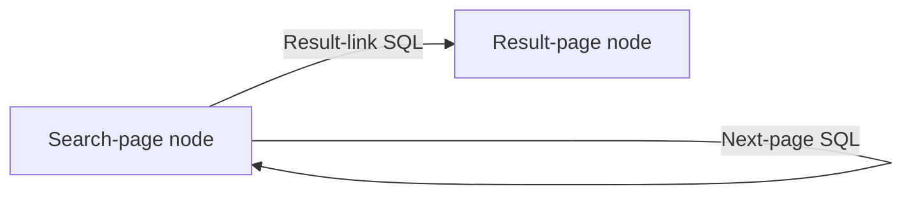

# Crawl Graphs

Status: accepted graph contract. The resource-governance and one-scope materialization cutover is
tracked in [AUDIT.md](../AUDIT.md). Any contract replacement is direct: delete superseded task,
primitive, queue, and action-specific traversal paths rather than adding compatibility bridges.

## Purpose

Atlas has accumulated enough durable crawl evidence and catalogue machinery that navigation no
longer needs to be embedded in separate search, index, or pagination actions. A completed crawl can
be understood through bounded SQL, and the URLs selected by that SQL can become subsequent crawl
work.

The uniform execution rule is:

> A graph node maps admitted URL inputs to crawl work. Once an HTML crawl is durable and its
> verified navigation package is referenced by NATS, every outgoing edge runs scoped SQL and offers
> its returned URLs to target nodes. A durable artifact crawl settles at that boundary without
> outgoing edge work.

This keeps acquisition replaceable. A browser library may load a page, but it is not the downstream
source of truth for links or navigation. Atlas retains immutable raw HTML, explicitly allowed
direct-response artifacts, a versioned structural DOM projection for HTML, and derived DuckLake
tables; graph edges operate only on HTML navigation evidence.

## Product model

The Postgres control plane contains four relevant definition types:

```text
CrawlGraph
CrawlGraphNode
CrawlGraphEdge
CrawlPolicy
```

Current execution uses NATS JetStream/KV:

```text
GraphRun
CrawlRequest
current crawl, navigation-package references, readiness, edge-evaluation, admission,
deduplication, and progress state
```

Durable evidence uses DuckLake:

```text
documents
artifacts
crawls with graph provenance
elements
materialized derived facts
materialization scope coverage
```

Ephemeral navigation bytes use the configured repository object store:

```text
runtime/navigation/<run_id>/documents/<document_id>/<recipe_hash>.arrow
```

There is no user-facing task or primitive hierarchy. `crawl` is the sole acquisition primitive and
is invoked by graph nodes. There is no graph result-rendering product in this model. Users inspect
findings through catalogue SQL, saved queries, views, and materializations.

## Control-plane entities

### CrawlGraph

`CrawlGraph` is a stable identity and a place for user metadata and joins:

```text
id
name
description
created_at
```

It does not contain serialized topology, execution state, URL lists, or execution limits. Topology
is represented by rows in `CrawlGraphNode` and `CrawlGraphEdge`. URL-matched crawl policies own
remote pressure and acquisition behavior.

Graphs do not have graph-level revisions. A graph evolves by adding and deleting its constituent
nodes and edges. An unused node or edge may be edited. After a component has participated in a run,
the entire row is immutable; any change means deleting it and creating another row.
Deletion never affects an active run because the run owns a complete frozen graph snapshot in NATS.
Each graph has one nullable `root_node_id`. A graph with no root is a valid draft but cannot run.
Creating the first node assigns it as root atomically; changing the root affects only future runs,
and deleting the root returns the graph to draft state.

### CrawlGraphNode

A node is a named acquisition stage inside one graph:

```text
id
graph_id
name
description
created_at
used_at, nullable
```

A node accepts URL inputs. Each admitted URL becomes independent crawl work; the node does not store
a growing list of URLs in Postgres and does not combine all of its inputs into one indivisible batch.
Independent work preserves per-URL claiming, retries, progress, failure isolation, provenance, and
bounded local browser concurrency.

One node may receive many URL inputs over a graph run. A self-edge can repeatedly feed new URLs back
to the same node. Repeated runtime invocations are not additional node definitions.

When a graph is triggered, its frozen root node receives the trigger URL inputs. The root may also
receive URLs from edges and participate in cycles; being root only determines initial admission.

The node does not write DuckLake directly. It maps admitted inputs to the ordinary crawl path, which
stores immutable HTML or explicitly allowed direct-response artifact bytes and publishes ingestion
work. Ingestion workers own base evidence, navigation-package publication, and outgoing edges.
Artifact crawls are successful terminal observations and do not activate outgoing edges.
Materialization workers independently maintain user-created live materialized views.

### CrawlGraphEdge

An edge is a directed, bounded SQL transformation:

```text
id
graph_id
source_node_id
target_node_id
name
description
sql
dedupe_mode: graph | crawl | document (default graph)
created_at
used_at, nullable
```

The source and target nodes belong to the same graph. For every crawl completed by the source node,
the edge SQL executes once with a bound `$crawl_id`. Each returned URL is a candidate input for the
target node.

Deduplication runs after SQL selection and URL normalization:

- `graph` suppresses a URL already admitted anywhere in the current graph run;
- `crawl` suppresses repeated URLs emitted by this edge for one source crawl; and
- `document` suppresses repeated URLs emitted by this edge for crawls sharing one source document.

The crawl and document scopes include the edge identity, so independent edges do not suppress one
another. SQL `LIMIT` is applied before deduplication and may therefore yield fewer admitted requests
than selected rows. Seed URLs use graph-wide deduplication.

The minimum result contract is one URL column:

```sql
SELECT url
FROM page.links
WHERE crawl_id = $crawl_id
  AND is_http
LIMIT 10;
```

Additional result columns may become frozen request fields or provenance metadata only when an
active caller requires them. Atlas must not prematurely turn the edge result into a general message
or arbitrary workflow payload.

An edge does not:

- acquire pages itself;
- mutate DuckLake or Postgres;
- publish to external systems;
- run arbitrary application code; or
- produce a human-facing final result.

SQL `LIMIT` expresses intended edge cardinality. There is no duplicate
`max_outputs_per_source` edge field. The catalogue independently enforces hard row, byte, memory,
and timeout ceilings. Returned URLs enter the ordinary crawl-request path, where URL matching
selects the effective crawl policy.

### CrawlPolicy

CrawlPolicy selects reusable acquisition behavior and controls courtesy pressure for matching
remote URLs. It is not attached to a graph or node. CrawlProfile owns transport behavior:

```text
Acquisition profile
- transport: http | browser | firecrawl
- config: transport-specific identity, waits, timeouts, safe headers, provider options, cache, and artifacts
- cost_rank: deterministic order for optional acquisition trials
```

Every HTTP profile carries a descriptive crawler User-Agent with operator contact. That identity is
frozen with the request and included in crawl evidence and cache identity. Direct acquisition
classifies HTTP status before response media type, and retryable transport/status failures retain
their durable CrawlRequest for bounded JetStream redelivery before one terminal observation is
published.

The policy owns `{scheme, host, path_prefix, path_mode, profile_id, max_concurrency}`. Exact scheme,
exact host, exact path, then longest prefix determine the winner. Deployment setup seeds five
profiles and one editable `*://*/*` policy using Direct HTTP acquisition. There is no separate
URL-match table, priority, domain group, or implicit default lane. Every profile performs one URL
acquisition. HTTP profiles may retain explicitly allowed direct-response
PDF, image, or video bytes; browser and provider profiles retain HTML only until they can preserve
exact main-response bytes. External providers perform one page acquisition; graph edges remain the
only navigation mechanism.

Two requests in the same graph may resolve different policies because their URLs match different
remotes. The frozen profile routes work to a transport-specific NATS subject before publication, so
HTTP, browser, and external-provider acquisition deployments scale independently. The Resource
Governor enforces policy concurrency across all acquisition replicas with expiring permits scoped
to the frozen policy revision. A remote permit is held only for an actual remote visit, not for
repository cache lookup, object persistence, ingestion, or navigation waiting. Browser work also
takes a browser-worker-local permit to protect that Chromium process. Exact profile configuration
remains code-owned.

Atlas may sample a bounded share of use requests and run one shadow acquisition with a different
frozen policy. Samples reuse the normal transport and repository implementations but never become
graph work, advance edges, gate graph completion, or mutate policy matching. The paired DuckLake
evidence contract is defined in [TRIALS.md](TRIALS.md).

## Runtime entities

### GraphRun

A graph run is the current execution created when a user or schedule triggers a graph. It is a NATS
KV entity, not a Postgres history row and not one queue message. At trigger time it freezes the
complete executable graph: active nodes, entry flags, active edges, edge SQL, and their identities.
Later Postgres edits, additions, or deletions cannot change the active run.

It correlates:

```text
id
graph_id
trigger inputs
frozen graph snapshot
current status
seen request identities
current failures and progress
```

One graph run may produce many independently queued crawl requests. Durable crawl rows retain the
run identifier for analysis after current NATS state expires.

### CrawlRequest

A crawl request is one queued URL assigned to one graph node:

```text
id
graph_run_id
node_id
url
document_id, nullable
effective crawl policy snapshot
source_crawl_id, nullable
source_edge_id, nullable
parent_request_id, nullable
```

Seed URLs have no source crawl or edge. URLs returned by edge SQL carry both. The published envelope
freezes the request, target node, effective policy, and provenance so later control-plane edits do
not mutate queued work.

`CrawlRequest` is the queue concept previously discussed as `NodeInput`; there is no separate
Postgres `NodeInput` model.

One logical request always represents one URL. Multiple trigger or edge URLs create independently
claimable requests and can run concurrently. A future external scraper may group compatible
requests into a transport-level `CrawlDispatch`, but partial success, retries, ingestion, and edge
activation remain per request. Dispatch batching is NATS/provider state and does not change the
graph contract.

## Execution semantics

### Trigger and seed admission

Triggering a graph creates a graph run, freezes the current executable graph, and offers every
trigger URL to the frozen `root_node_id`. Each URL enters the ordinary
crawl-request path:

```text
candidate URL
    |
normalize request identity
    |
already seen for the edge's frozen deduplication scope?
    +-- yes --> reject as duplicate
    `-- no
         |
platform graph-run ceiling reached?
    +-- yes --> stop the runaway run visibly
    `-- no
         |
resolve matching CrawlPolicy and freeze it
         |
create current state and publish CrawlRequest
```

Deduplication state and queue delivery live in JetStream/KV. Postgres contains only user
configuration.

### Acquisition and ingestion

An acquisition worker claims one crawl request from its transport-specific subject, requests the
frozen policy's remote permit, acquires the URL through the shared crawl path, releases remote and
local browser pressure, requests bounded object-write capacity, writes immutable HTML or artifact
bytes through the repository boundary, and publishes a frozen ingestion job. It never opens
DuckLake or waits for downstream processing.

An ingestion worker validates the raw object and heartbeats the durable ingestion delivery while
waiting for the required `critical` catalogue/object-store resource bundle. Capacity waiting is not
a processing attempt or failure. HTML commits crawl/document/element evidence, then publishes a
verified navigation package and evaluates outgoing edges. An artifact commits its
canonical artifact row and crawl observation, then settles without DOM or outgoing edges. User
materialization runs in separate workers and cannot change the crawl request's terminal state.

The crawl request may transition through states such as:

```text
queued
crawling
awaiting_navigation
evaluating_edges
complete
failed
```

The invariant is that no acquisition worker sleeps while waiting for ingestion, navigation
publication, edge evaluation, or materialization.

### One crawl-ready barrier

Graph execution uses one logical readiness barrier:

```text
base crawl ingestion complete
        |
Arrow navigation package written and verified in S3 / MinIO
        |
durable NATS package reference published
        |
crawl ready for outgoing edges
```

Artifact ingestion crosses the same barrier with no navigation package and settles terminally.

The package is page-local Arrow data exposed as `page.links`. The `page.*` namespace means ephemeral
relations derived from the current source page and available only while evaluating its outgoing
edges. The package's NATS reference contains the object key, SHA-256, byte size, recipe version, and
row count. Edge execution verifies size and digest before registering it on a dedicated DuckDB
connection. `views.*` remains user territory; no Atlas runtime or correctness path depends on a view
or its materialization state.

After the base crawl commit, CDC and activation backfill may discover deterministic materialization
scopes. A separate materialization worker owns one scope from evaluation through authoritative
coverage under `live` or `backfill` resource admission. Its failure is observable and retryable but
cannot fail navigation, hold a crawl request at the readiness fence, or keep a graph run active.
Raw HTML is the permanent regeneration authority if an ephemeral package is missing. Artifacts have
no navigation package and cross the same readiness boundary as terminal content.

### Edge activation

When a crawl becomes ready, every outgoing edge from its node in the frozen graph is evaluated
independently:

```text
ready crawl
├── edge A SQL($crawl_id)
├── edge B SQL($crawl_id)
└── edge C SQL($crawl_id)
```

An edge evaluates the one source crawl, not the complete historical output of the node. Aggregate or
barrier edges over all node results are outside the initial contract and require a demonstrated
caller before introduction.

Every returned URL re-enters the same generic crawl-request path. SQL selects interesting
candidates; URL matching selects and freezes the remote's crawl policy before work is published.

### Recursion and cycles

Directed cycles are valid graph topology. A self-edge means that a completed crawl may produce more
inputs for the same node:

```text
search_page -- pagination SQL --> search_page
```

Graph-wide deduplication prevents exact cycles by default, while a deployment-level hard ceiling on requests and
run duration prevents a malformed self-edge from producing unbounded unique URLs. There is no
pagination-specific loop counter and no graph, node, edge, or crawl-policy work budget. Edge SQL is
responsible for intended termination; the platform ceiling is an emergency safety boundary.

## Search graph example

A paginated search that crawls each result requires two nodes and two edges:

```text
Nodes
- search_page
- result_page

Edges
- search_page -> search_page: next-page SQL
- search_page -> result_page: result-link SQL
```



The persisted graph stays fixed while runtime invocations expand:

```text
search page 1
├── result URLs -> result_page
└── page 2      -> search_page

search page 2
├── result URLs -> result_page
└── page 3      -> search_page
```

Because every completed `search_page` crawl activates both outgoing edges, result URLs from every
page are offered to `result_page`. The pagination SQL eventually returns no next page. Request
deduplication handles cycles, and the platform hard ceiling stops a defective query from running
forever.

Example result edge:

```sql
SELECT url
FROM page.links
WHERE crawl_id = $crawl_id
  AND is_http
  AND NOT is_internal
ORDER BY element_index
LIMIT 10;
```

Example self-edge:

```sql
SELECT url
FROM page.links
WHERE crawl_id = $crawl_id
  AND is_same_page
  AND is_query_variant
ORDER BY element_index
LIMIT 1;
```

Ordinary anchors are not the only possible navigation evidence. Form-based pagination may require a
crawl-scoped form materialization and, once an active caller proves the need, a frozen request
contract broader than a GET URL. This extends the crawl request boundary; it does not add a new
acquisition primitive or node type.

## Messaging and idempotency

The logical message flow is:

```text
Graph trigger
    |
admit seed CrawlRequests
    |
transport-routed acquisition
    |
repository ingestion job
    |
durable DuckLake base scope
    |
verified navigation readiness
    |
outgoing edge evaluation jobs
    |
admit target-node CrawlRequests

Independent branch after base ingestion or CDC discovery:

materialization scope -> materialization worker -> durable live-view coverage
```

Before an expensive phase starts, its worker requests an atomic expiring resource bundle. Capacity
permits are not additional work messages and are not included in the durable completion chain.

Delivery is at-least-once. Correctness therefore requires deterministic identities or equivalent KV
compare-and-swap transitions for:

- crawl request admission;
- ingestion jobs;
- materialization scope jobs;
- crawl-ready processing;
- one edge evaluation for a source crawl; and
- target-node request creation.

An edge evaluator must not mark an evaluation complete before admitted target requests have durable
current state and recoverable queue publication. Redelivery after a crash must find existing target
request identities rather than create duplicates.

NATS messages are notifications and work delivery, not permanent analytical history. DuckLake
retains crawl and graph provenance. Navigation readiness is independent from user materialization
coverage; that coverage remains authoritative only for view freshness and recovery.

## Provenance

Every durable crawl observation must be attributable to graph execution without making DuckLake the
execution owner. The target crawl record needs provenance equivalent to:

```text
graph_id
graph_run_id
graph_node_id
crawl_request_id
source_crawl_id, nullable
source_edge_id, nullable
```

The exact physical schema is an implementation decision. These identifiers replace task,
task-revision, and primitive provenance rather than coexisting as compatibility aliases.

## Deliberate exclusions

Crawl graphs do not initially include:

- arbitrary compute nodes;
- external side-effect edges;
- destination connectors;
- graph-defined result rendering;
- a Postgres history row for every graph run or URL;
- graph-level revisions;
- aggregate edges that wait for every result from a node;
- a separate edge cardinality field duplicating SQL `LIMIT`;
- per-edge materialization dependency lists;
- graph, node, edge, or crawl-policy work budgets; or
- user-configurable recursion counters.

These exclusions keep the graph model specific to composing crawl acquisition from durable evidence.

## Scheduling and lifecycle

Schedules are inputs to graphs. When a schedule fires, it supplies its configured URLs to a new run;
the run freezes the current graph and offers those URLs to its root node. Scheduling does not
create another execution abstraction or store current work in Postgres.

Unused nodes and edges may be edited. Before publishing a frozen run, triggering marks `used_at` on
every included component. Once `used_at` is non-null, the row cannot be edited; it may still be
deleted. Deleting a node also deletes its connected edges from the current Postgres graph. Active
runs are unaffected because their complete executable graph is frozen in NATS. Durable DuckLake
provenance may retain component IDs whose Postgres definitions were later deleted.

Runtime state remains in NATS only while operationally useful. User graph configuration stays in
Postgres, while raw HTML, artifacts, crawl observations, elements, derived facts, and graph provenance remain
durable in repository objects and DuckLake. Exact NATS cleanup timing is deployment configuration,
not part of the graph data model.

The platform enforces a non-user-configurable hard ceiling on CrawlRequests per GraphRun and graph-run
wall duration. Hitting either ceiling terminates the run visibly. These are emergency runaway
guards, not graph behavior or crawl-policy settings.

## Frozen implementation contracts

The runtime uses the following names and payloads. Change this section before implementations
diverge; do not introduce aliases for alternative names.

### Postgres tables

```text
crawl_graphs
- id UUID primary key
- name TEXT
- description TEXT
- position_x DOUBLE PRECISION nullable
- position_y DOUBLE PRECISION nullable
- root_node_id UUID nullable references crawl_graph_nodes on delete set null
- created_at TIMESTAMPTZ

crawl_graph_nodes
- id UUID primary key
- graph_id UUID references crawl_graphs on delete cascade
- name TEXT
- description TEXT
- used_at TIMESTAMPTZ nullable
- created_at TIMESTAMPTZ

crawl_graph_edges
- id UUID primary key
- graph_id UUID references crawl_graphs on delete cascade
- source_node_id UUID references crawl_graph_nodes on delete cascade
- target_node_id UUID references crawl_graph_nodes on delete cascade
- name TEXT
- description TEXT
- sql TEXT
- dedupe_mode ENUM: graph | crawl | document, default graph
- used_at TIMESTAMPTZ nullable
- created_at TIMESTAMPTZ
```

Node and edge names are unique within one graph. Both edge endpoints must belong to `graph_id`.
Nodes and edges with non-null `used_at` reject execution-definition updates. Node position is
display-only metadata, is excluded from frozen snapshots, and remains editable after use. Deleting
a node deletes every connected edge. The root must belong to the graph. Graph deletion deletes its
nodes and edges.

### Frozen graph snapshot

The control plane produces this complete execution value before runtime publication:

```json
{
  "graph_id": "uuid",
  "root_node_id": "uuid",
  "nodes": [
    {
      "id": "uuid",
      "name": "search_page"
    }
  ],
  "edges": [
    {
      "id": "uuid",
      "name": "next_page",
      "source_node_id": "uuid",
      "target_node_id": "uuid",
      "sql": "SELECT url ... WHERE crawl_id = $crawl_id LIMIT 1",
      "dedupe_mode": "graph"
    }
  ]
}
```

Descriptions are control-plane display metadata and are not required in the runtime snapshot.
Freezing marks every included node and edge `used_at` before the run is published.

### HTTP API

```text
GET    /crawl-graphs/
POST   /crawl-graphs/
GET    /crawl-graphs/{graph_id}
PUT    /crawl-graphs/{graph_id}
DELETE /crawl-graphs/{graph_id}

POST   /crawl-graphs/{graph_id}/nodes
PUT    /crawl-graphs/{graph_id}/nodes/{node_id}
PUT    /crawl-graphs/{graph_id}/nodes/{node_id}/position
DELETE /crawl-graphs/{graph_id}/nodes/{node_id}

POST   /crawl-graphs/{graph_id}/edges
PUT    /crawl-graphs/{graph_id}/edges/{edge_id}
DELETE /crawl-graphs/{graph_id}/edges/{edge_id}

POST   /crawl-graphs/{graph_id}/runs
GET    /crawl-graphs/{graph_id}/runs/active
GET    /graph-runs/
GET    /graph-runs/{run_id}
GET    /graph-runs/{run_id}/warnings
POST   /graph-runs/{run_id}/cancel
GET    /graph-runs/{run_id}/events
```

The warnings endpoint groups durable failed or partial acquisition evidence by typed failure code,
HTTP status, response media type, retryability, and top registrable domains. It also reports how
many current run warnings are still awaiting DuckLake ingestion. Capacity waits and Atlas pipeline
failures are not acquisition warnings.

The run trigger body is exactly:

```json
{"urls": ["https://example.com/a", "https://example.com/b"]}
```

It rejects an empty list and a graph with no root node. Every URL is offered to the root node.

The run event endpoint is one multiplexed `text/event-stream` response backed by current NATS
projection state. It sends a complete snapshot of every node and edge first, then component deltas,
an independent heartbeat while idle, and a final settled event. React components subscribe
logically through the client run-progress store; they do not open one physical connection each.
Node progress contains admitted request counts by current `CrawlRequest.status`. Edge progress
contains pending, running, completed, and failed evaluation counts plus:

```text
urls_selected     rows returned by the edge SQL
urls_admitted     durable target CrawlRequests whose source_edge_id is this edge
urls_deduplicated max(0, urls_selected - urls_admitted)
```

Running edge evaluations checkpoint selected, admitted, and deduplicated counts every ten rows so
large result sets advance live without writing NATS KV once per output URL. Request transitions
update per-component projections incrementally; the UI never scans all CrawlRequests. These are
current execution projections, not DuckLake history.

### NATS ownership and names

```text
JetStream stream: ATLAS_GRAPH_WORK
subjects:
- atlas.graph.crawl.http
- atlas.graph.crawl.browser
- atlas.graph.crawl.provider.firecrawl
- atlas.graph.edge
- atlas.graph.readiness

durable consumers:
- atlas-graph-crawl-http-workers
- atlas-graph-crawl-browser-workers
- atlas-graph-crawl-firecrawl-workers
- atlas-graph-edge-workers
- atlas-graph-readiness-workers

KV buckets:
- atlas_graph_runs
- atlas_crawl_requests
- atlas_graph_workers
- atlas_graph_progress
- atlas_policy_trial_budget

Shared operational KV outside graph ownership:
- operation-lease state
- atlas_resource_grants
```

`atlas_policy_trial_budget` is the atomic bounded set of active shadow sample request identities.
It prevents a traffic spike from exceeding `ATLAS_POLICY_TRIAL_MAX_IN_FLIGHT`; the durable crawl
evidence remains in DuckLake rather than this operational KV projection.

`GraphRun` current state contains:

```text
id
graph_id
trigger_kind: manual
status: queued | running | completed | completed_with_errors | failed | cancelled
snapshot
trigger_urls
seen_request_identities
request_count
created_at
started_at nullable
last_progress_at nullable
completed_at nullable
cancel_requested_at nullable
error nullable
```

`CrawlRequest` current state and queue envelopes contain:

```text
id
graph_run_id
node_id
url
transport: http | browser | firecrawl
document_id nullable
artifact_id nullable
effective_policy_snapshot_json
source_crawl_id nullable
source_edge_id nullable
parent_request_id nullable
status: queued | crawling | awaiting_navigation |
        evaluating_edges | completed | failed | cancelled
created_at
updated_at
error nullable
```

Admission identities are deterministic hashes of the normalized URL and frozen deduplication scope:

```text
graph    graph_run_id + normalized_url
crawl    graph_run_id + edge_id + source_crawl_id + normalized_url
document graph_run_id + edge_id + source_document_id + normalized_url
```

Every admitted URL also records its graph-wide identity, allowing a later graph-scoped edge to
recognize URLs first admitted through a narrower scope. Edge evaluation identity is the hash of
`graph_run_id`, `crawl_request_id`, `crawl_id`, and `edge_id`.

The deployment-only ceilings are:

```text
ATLAS_GRAPH_MAX_REQUESTS_PER_RUN=10000
ATLAS_GRAPH_MAX_RUN_SECONDS=3600
ATLAS_GRAPH_STREAM_REPLICAS=1
ATLAS_GRAPH_ACK_WAIT_SECONDS=60
ATLAS_GRAPH_STATE_MAX_BYTES=268435456
```

They are deployment environment configuration, never graph, node, edge, trigger, or crawl-policy
fields.

### Repository provenance

Frozen ingestion jobs and DuckLake `crawls` rows replace task provenance with:

```text
graph_id UUID
graph_run_id UUID
graph_node_id UUID
crawl_request_id UUID
source_crawl_id UUID nullable
source_edge_id UUID nullable
```

There are no task-ID, task-revision, primitive, or compatibility provenance columns. Each row is
exactly one acquisition and also stores its transport `profile`, `crawl_profile_id`,
`crawl_profile_slug`, `remote_concurrency`, `config_json`, `config_hash`, and typed outcome. Canonical document-quality
measurements live once on `documents`; they are not copied into every crawl observation.

### Navigation readiness and asynchronous materialization

Materialization does not maintain a per-crawl fan-out plan. CDC and activation backfill derive
deterministic scope identities directly from eligible crawls and active definition revisions. Both
may rediscover the same scope safely.

DuckLake `materialization_scope_results` coverage is the sole completion authority. Pending work and
per-run lag are derived as eligible crawl-definition scopes minus successful coverage. Queue depth,
permit state, and worker progress are operational diagnostics and never graph readiness or
materialization truth.

One materialization scope message owns bounded evaluation, optional deterministic staging, atomic
scope replacement, and coverage. There is no separate fan-out settlement or commit-delivery queue.

The readiness work payload is:

```json
{
  "event_id": "uuid",
  "crawl_id": "uuid",
  "graph_run_id": "uuid",
  "crawl_request_id": "uuid",
  "navigation": {
    "object_name": "runtime/navigation/<run>/documents/<document>/<recipe>.arrow",
    "sha256": "hex",
    "byte_size": 1234,
    "schema_version": 1,
    "recipe": "hex",
    "row_count": 12
  },
  "occurred_at": "timestamp"
}
```

The repository ingestion result stores the same package reference in NATS before work is
acknowledged. If readiness publication fails, redelivery republishes from that durable state.
`event_id` and the edge-evaluation identity make redelivery idempotent.

Artifact readiness uses the same payload with `navigation: null`. It settles the crawl request
without publishing edge work. A successful crawl references exactly one of `document_id` or
`artifact_id`; response media type and filename remain observation fields on `crawls`, while the
`artifacts` row contains canonical hash, object key, byte size, and creation time.

## Cutover rule

Atlas is greenfield. Implement crawl graphs as a direct contract replacement:

- remove Postgres tasks rather than aliasing them to graphs;
- remove task revisions and primitive dispatch rather than translating them indefinitely;
- remove special search and index traversal loops once their graph equivalents are active;
- replace task provenance columns rather than dual-writing task and graph identifiers;
- reset disposable development state instead of adding migration bridges; and
- retain semantic extraction or calibration only as explicit retained-evidence capabilities, not as
  hidden navigation paths.

Version control preserves the old implementation. The running system should have one execution
model.
