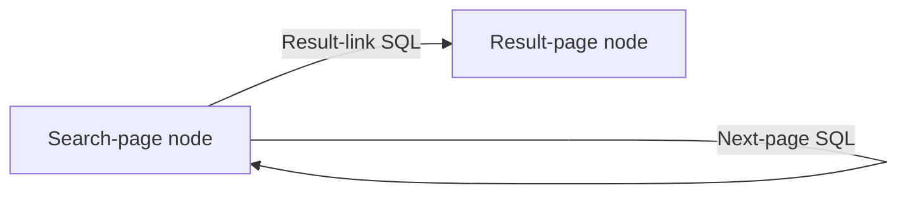

# Crawl Graphs

Status: implementation-ready target design. The task/action-to-graph cutover is not yet complete.
During the cutover, change the contract directly and delete superseded task, primitive, and
action-specific traversal paths rather than adding compatibility bridges.

## Purpose

Atlas has accumulated enough durable crawl evidence and catalogue machinery that navigation no
longer needs to be embedded in separate search, index, or pagination actions. A completed crawl can
be understood through bounded SQL, and the URLs selected by that SQL can become subsequent crawl
work.

The uniform execution rule is:

> A graph node maps admitted URL inputs to crawl work. Once the crawl is durable and all
> materializations it triggered have settled successfully, every outgoing edge runs scoped SQL and
> offers its returned URLs to target nodes.

This keeps acquisition replaceable. A browser library may load a page, but it is not the downstream
source of truth for links or navigation. Atlas retains immutable raw HTML, a versioned structural DOM
projection, and derived DuckLake tables; graph edges operate on that evidence.

## Product model

The Postgres control plane contains four relevant definition types:

```text
CrawlGraph
CrawlGraphNode
CrawlGraphEdge
CrawlPolicy
```

Current execution uses NATS JetStream/KV:

```text
GraphRun
CrawlRequest
current crawl, readiness, edge-evaluation, admission, deduplication, and progress state
```

Durable evidence uses DuckLake:

```text
documents
crawls with graph provenance
elements
materialized derived facts
materialization scope coverage
```

There is no user-facing task or primitive hierarchy. `crawl` is the sole acquisition primitive and
is invoked by graph nodes. There is no graph result-rendering product in this model. Users inspect
findings through catalogue SQL, saved queries, views, and materializations.

## Control-plane entities

### CrawlGraph

`CrawlGraph` is a stable identity and a place for user metadata and joins:

```text
id
name
description
created_at
```

It does not contain serialized topology, execution state, URL lists, or execution limits. Topology
is represented by rows in `CrawlGraphNode` and `CrawlGraphEdge`. URL-matched crawl policies own
remote pressure and acquisition behavior.

Graphs do not have graph-level revisions. A graph evolves by adding and deleting its constituent
nodes and edges. An unused node or edge may be edited. After a component has participated in a run,
the entire row is immutable; any change means deleting it and creating another row.
Deletion never affects an active run because the run owns a complete frozen graph snapshot in NATS.

### CrawlGraphNode

A node is a named acquisition stage inside one graph:

```text
id
graph_id
name
description
is_entry
created_at
used_at, nullable
```

A node accepts URL inputs. Each admitted URL becomes independent crawl work; the node does not store
a growing list of URLs in Postgres and does not combine all of its inputs into one indivisible batch.
Independent work preserves per-URL claiming, retries, progress, failure isolation, provenance, and
bounded local browser concurrency.

One node may receive many URL inputs over a graph run. A self-edge can repeatedly feed new URLs back
to the same node. Repeated runtime invocations are not additional node definitions.

When a graph is triggered, every entry node in the frozen graph receives the trigger URL inputs. `is_entry` does
not otherwise change node behavior: an entry node may also receive URLs from edges and participate
in cycles.

The node does not write DuckLake directly. It maps admitted inputs to the ordinary crawl path, which
stores immutable raw HTML and publishes ingestion work. The repository worker remains the only
application authority requesting DuckLake writes.

### CrawlGraphEdge

An edge is a directed, bounded SQL transformation:

```text
id
graph_id
source_node_id
target_node_id
name
description
sql
created_at
used_at, nullable
```

The source and target nodes belong to the same graph. For every crawl completed by the source node,
the edge SQL executes once with a bound `$crawl_id`. Each returned URL is a candidate input for the
target node.

The minimum result contract is one URL column:

```sql
SELECT url
FROM materialized.page_links
WHERE crawl_id = $crawl_id
  AND is_http
LIMIT 10;
```

Additional result columns may become frozen request fields or provenance metadata only when an
active caller requires them. Atlas must not prematurely turn the edge result into a general message
or arbitrary workflow payload.

An edge does not:

- acquire pages itself;
- mutate DuckLake or Postgres;
- publish to external systems;
- run arbitrary application code; or
- produce a human-facing final result.

SQL `LIMIT` expresses intended edge cardinality. There is no duplicate
`max_outputs_per_source` edge field. The catalogue independently enforces hard row, byte, memory,
and timeout ceilings. Returned URLs enter the ordinary crawl-request path, where URL matching
selects the effective crawl policy.

### CrawlPolicy

Crawl policy controls pressure and acquisition behavior for matching remote URLs. It is selected
through Atlas URL matching, not attached to a graph or node. The effective policy may cover:

```text
Acquisition
- request/browser mode
- waits and timeout
- retries
- headers or other frozen request settings
- per-worker concurrency or rate pressure for the matching remote
```

The exact policy schema remains code-owned. Two requests in the same graph may resolve different
policies because their URLs match different remotes. Browser concurrency is enforced locally per
worker; NATS does not introduce a global browser semaphore.

## Runtime entities

### GraphRun

A graph run is the current execution created when a user or schedule triggers a graph. It is a NATS
KV entity, not a Postgres history row and not one queue message. At trigger time it freezes the
complete executable graph: active nodes, entry flags, active edges, edge SQL, and their identities.
Later Postgres edits, additions, or deletions cannot change the active run.

It correlates:

```text
id
graph_id
trigger inputs
frozen graph snapshot
current status
seen request identities
current failures and progress
```

One graph run may produce many independently queued crawl requests. Durable crawl rows retain the
run identifier for analysis after current NATS state expires.

### CrawlRequest

A crawl request is one queued URL assigned to one graph node:

```text
id
graph_run_id
node_id
url
effective crawl policy snapshot
source_crawl_id, nullable
source_edge_id, nullable
parent_request_id, nullable
```

Seed URLs have no source crawl or edge. URLs returned by edge SQL carry both. The published envelope
freezes the request, target node, effective policy, and provenance so later control-plane edits do
not mutate queued work.

`CrawlRequest` is the queue concept previously discussed as `NodeInput`; there is no separate
Postgres `NodeInput` model.

One logical request always represents one URL. Multiple trigger or edge URLs create independently
claimable requests and can run concurrently. A future external scraper may group compatible
requests into a transport-level `CrawlDispatch`, but partial success, retries, ingestion, and edge
activation remain per request. Dispatch batching is NATS/provider state and does not change the
graph contract.

## Execution semantics

### Trigger and seed admission

Triggering a graph creates a graph run, freezes the current executable graph, and offers every
trigger URL to every active node whose frozen `is_entry` value is true. Each URL enters the ordinary
crawl-request path:

```text
candidate URL
    |
normalize request identity
    |
already seen for the relevant run/node scope?
    +-- yes --> reject as duplicate
    `-- no
         |
platform graph-run ceiling reached?
    +-- yes --> stop the runaway run visibly
    `-- no
         |
resolve matching CrawlPolicy and freeze it
         |
create current state and publish CrawlRequest
```

Deduplication state and queue delivery live in JetStream/KV. Postgres contains only user
configuration.

### Acquisition and ingestion

A runtime worker claims one crawl request, acquires the page through the shared crawl path, writes
immutable raw HTML through the repository object boundary, and publishes a frozen ingestion job.
Only the repository worker validates staging and requests the DuckLake crawl/document/element
commit.

The crawl request may transition through states such as:

```text
queued
crawling
awaiting_ingestion
awaiting_enrichment
evaluating_edges
complete
failed
```

These names are illustrative until the runtime schema is implemented. The invariant is that no
browser worker sleeps while waiting for repository or materialization completion.

### One crawl-ready barrier

Graph execution uses one logical readiness barrier:

```text
base crawl ingestion complete
        |
materialization planner records its complete fan-out
        |
all triggered materialization jobs settle successfully
        |
crawl ready for outgoing edges
```

The materialization planner durably establishes which materialization jobs the newly committed crawl
triggers. The graph engine waits for that finite fan-out to settle. “All materializations complete”
means all jobs triggered for this crawl, not every materialization in the catalogue. If planning
produces no jobs, the crawl is ready immediately after planning completes.

Every triggered job records durable scope coverage, including a successful zero-row result. A
terminal failure is explicit; edges must never interpret a missing or failed scope as an empty
result. A later materialization cannot join an already completed planning fan-out and move the
finish line.

The graph runtime receives one logical crawl-ready notification. It does not track per-edge
materialization dependency lists. NATS provides wake-up latency, while DuckLake scope coverage is the
authoritative readiness proof and supports reconciliation after a lost notification.

Materialization failures use the materialization system's bounded retry and recovery path. If any
triggered job fails terminally, the crawl request fails and its outgoing edges do not run. Other
branches continue. A run with no remaining work and one or more failed requests ends as
`completed_with_errors`; requeuing the failed materialization can resume readiness without
reacquiring the page.

### Edge activation

When a crawl becomes ready, every outgoing edge from its node in the frozen graph is evaluated
independently:

```text
ready crawl
├── edge A SQL($crawl_id)
├── edge B SQL($crawl_id)
└── edge C SQL($crawl_id)
```

An edge evaluates the one source crawl, not the complete historical output of the node. Aggregate or
barrier edges over all node results are outside the initial contract and require a demonstrated
caller before introduction.

Every returned URL re-enters the same generic crawl-request path. SQL selects interesting
candidates; URL matching selects and freezes the remote's crawl policy before work is published.

### Recursion and cycles

Directed cycles are valid graph topology. A self-edge means that a completed crawl may produce more
inputs for the same node:

```text
search_page -- pagination SQL --> search_page
```

Request deduplication prevents exact cycles, while a deployment-level hard ceiling on requests and
run duration prevents a malformed self-edge from producing unbounded unique URLs. There is no
pagination-specific loop counter and no graph, node, edge, or crawl-policy work budget. Edge SQL is
responsible for intended termination; the platform ceiling is an emergency safety boundary.

## Search graph example

A paginated search that crawls each result requires two nodes and two edges:

```text
Nodes
- search_page
- result_page

Edges
- search_page -> search_page: next-page SQL
- search_page -> result_page: result-link SQL
```



The persisted graph stays fixed while runtime invocations expand:

```text
search page 1
├── result URLs -> result_page
└── page 2      -> search_page

search page 2
├── result URLs -> result_page
└── page 3      -> search_page
```

Because every completed `search_page` crawl activates both outgoing edges, result URLs from every
page are offered to `result_page`. The pagination SQL eventually returns no next page. Request
deduplication handles cycles, and the platform hard ceiling stops a defective query from running
forever.

Example result edge:

```sql
SELECT url
FROM materialized.page_links
WHERE crawl_id = $crawl_id
  AND is_http
  AND NOT is_internal
ORDER BY element_index
LIMIT 10;
```

Example self-edge:

```sql
SELECT url
FROM materialized.page_links
WHERE crawl_id = $crawl_id
  AND is_same_page
  AND is_query_variant
ORDER BY element_index
LIMIT 1;
```

Ordinary anchors are not the only possible navigation evidence. Form-based pagination may require a
crawl-scoped form materialization and, once an active caller proves the need, a frozen request
contract broader than a GET URL. This extends the crawl request boundary; it does not add a new
acquisition primitive or node type.

## Messaging and idempotency

The logical message flow is:

```text
Graph trigger
    |
admit seed CrawlRequests
    |
runtime acquisition
    |
repository ingestion job
    |
durable DuckLake base scope
    |
materialization fan-out planning and commit
    |
durable terminal coverage for every triggered job
    |
crawl-ready notification
    |
outgoing edge evaluation jobs
    |
admit target-node CrawlRequests
```

Delivery is at-least-once. Correctness therefore requires deterministic identities or equivalent KV
compare-and-swap transitions for:

- crawl request admission;
- ingestion jobs;
- materialization scope jobs;
- crawl-ready processing;
- one edge evaluation for a source crawl; and
- target-node request creation.

An edge evaluator must not mark an evaluation complete before admitted target requests have durable
current state and recoverable queue publication. Redelivery after a crash must find existing target
request identities rather than create duplicates.

NATS messages are notifications and work delivery, not permanent analytical history. DuckLake
retains crawl and graph provenance. Materialization coverage remains authoritative for enrichment
readiness even if the crawl-ready notification is lost or duplicated.

## Provenance

Every durable crawl observation must be attributable to graph execution without making DuckLake the
execution owner. The target crawl record needs provenance equivalent to:

```text
graph_id
graph_run_id
graph_node_id
crawl_request_id
source_crawl_id, nullable
source_edge_id, nullable
```

The exact physical schema is an implementation decision. These identifiers replace task,
task-revision, and primitive provenance rather than coexisting as compatibility aliases.

## Deliberate exclusions

Crawl graphs do not initially include:

- arbitrary compute nodes;
- external side-effect edges;
- destination connectors;
- graph-defined result rendering;
- a Postgres history row for every graph run or URL;
- graph-level revisions;
- aggregate edges that wait for every result from a node;
- a separate edge cardinality field duplicating SQL `LIMIT`;
- per-edge materialization dependency lists;
- graph, node, edge, or crawl-policy work budgets; or
- user-configurable recursion counters.

These exclusions keep the graph model specific to composing crawl acquisition from durable evidence.

## Scheduling and lifecycle

Schedules are inputs to graphs. When a schedule fires, it supplies its configured URLs to a new run;
the run freezes the current graph and offers those URLs to every entry node. Scheduling does not
create another execution abstraction or store current work in Postgres.

Unused nodes and edges may be edited. Before publishing a frozen run, triggering marks `used_at` on
every included component. Once `used_at` is non-null, the row cannot be edited; it may still be
deleted. Deleting a node also deletes its connected edges from the current Postgres graph. Active
runs are unaffected because their complete executable graph is frozen in NATS. Durable DuckLake
provenance may retain component IDs whose Postgres definitions were later deleted.

Runtime state remains in NATS only while operationally useful. User graph configuration stays in
Postgres, while raw HTML, crawl observations, elements, derived facts, and graph provenance remain
durable in repository objects and DuckLake. Exact NATS cleanup timing is deployment configuration,
not part of the graph data model.

The platform enforces a non-user-configurable hard ceiling on CrawlRequests per GraphRun and graph-run
wall duration. Hitting either ceiling terminates the run visibly. These are emergency runaway
guards, not graph behavior or crawl-policy settings.

## Cutover rule

Atlas is greenfield. Implement crawl graphs as a direct contract replacement:

- remove Postgres tasks rather than aliasing them to graphs;
- remove task revisions and primitive dispatch rather than translating them indefinitely;
- remove special search and index traversal loops once their graph equivalents are active;
- replace task provenance columns rather than dual-writing task and graph identifiers;
- reset disposable development state instead of adding migration bridges; and
- retain semantic extraction or calibration only as explicit retained-evidence capabilities, not as
  hidden navigation paths.

Version control preserves the old implementation. The running system should have one execution
model.
