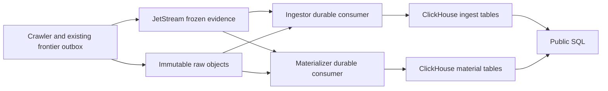

# A simpler ingestion and materialization pipeline

Proposed replacement on `codex/clickhouse-experiment`, inspected against
`origin/main` at `5e7c572`. This is a design and deletion plan, not an implemented
pipeline. Only the local ClickHouse server and candidate ingestion DDL have been
tested so far, plus the bounded JetStream delivery probe in the
[design review](DESIGN_REVIEW.md). That review updates this plan's collection,
query-history, capture-evidence, rebuild and janitor boundaries.

**Publish each frozen capture once to JetStream. Let ingestion and materialization
consume it independently. Put physical storage and indexes under ClickHouse. Keep
Python responsible for evidence validation, HTML parsing and narrowly scoped
publication correctness.**

This replaces the earlier proposed post-ingestion materialization outbox. The
frozen capture already contains the raw-object reference, metadata and visit
identity. Materialization does not need a database change event to discover work.

## 1. Proposed ownership



| Owner | Responsibility |
| --- | --- |
| Control Postgres | Durable customer collections and accounting, editable frontier state, transactional producer outbox, retirement decisions, bounded commit coordination and scoped backfill control |
| Raw-object repository | Immutable, content-addressed bytes |
| JetStream | Pending delivery, independent consumer progress, redelivery and backpressure |
| Ingestor | Validate evidence and objects; insert complete visit or lineage rows; reconcile uncertain writes |
| Materializer | Parse distinct content, derive visit-specific links, write bounded output and establish completion |
| ClickHouse | Retained evidence, material rows, indexes/projections, compression, merges and SQL-only derivations |

Keep the existing `periplus-ingestor` and `periplus-materializer` process names.
Their implementations shrink; no additional service is needed. Keep the crawler
independent of catalogue commit and parsing latency.

Both workers use the same validated event types. Materialization consumes only
visit events; lineage is ingestion-only. Either worker may finish first. Public
readiness requires accepted base evidence and completed material output; ACKs
do not establish SQL visibility. A conflicting ingestion identity must not gain
visibility through derived rows: associate visit-owned output with the validated
source identity/evidence digest and expose it through accepted evidence.
Shared-content output remains keyed by its full content hash.

For visit-specific links, the event provides effective/requested URL context.
Do not depend on an insert-trigger join finding another asynchronously arriving
table. Reused content can supply stored raw href/base information, with bounded
Python URL resolution per visit. Preserve URL and link semantics in tests.

## 2. Use JetStream persistence directly

The current [catalogue stream](../../../packages/periplus/src/periplus/platform/messaging/catalogue_queue.py)
uses `WorkQueuePolicy`, mixing ingestion with plan, batch and activation jobs.
Use **InterestPolicy** for the replacement live stream, with durable ingestor and
active-materializer pull consumers created before publication starts. Replicas of
each role share that role's consumer. One additional materializer consumer supports
an active background replacement; see section 5. Interest retention releases messages after all matching
consumers finish; work-queue retention prohibits overlapping consumers.
[NATS retention policies](https://docs.nats.io/learn/jetstream/retention-policies)

Configure file storage, R=1 locally and R=3 on the existing homelab. Use no
automatic age expiry for pending live work, a byte limit and `DiscardNew`.
Disable inactivity deletion for these durable consumers. Startup reconciles both
consumers and filters before capture admission becomes ready; runtime requests
reuse the handles. Consumer deletion/filter changes require an explicit topology
change. Do not add a consumer per projection.

A slow parser holds pending work. At the byte limit, publication fails visibly
and the existing producer outbox retries. Size the stream using measured envelope
bytes × arrival rate × supported outage duration, plus replication and overhead.
The current 512 MiB catalogue limit is not automatically an adequate budget.
Keep HTML and large parsed payloads out of messages.

Interest retention is pending-work storage. Once both consumers ACK, rebuild
from ClickHouse ingestion evidence and raw objects; a new consumer cannot replay
removed messages. Preserve the original envelope in a stage-specific dead letter
before terminating a permanent failure. Its raw-object protection must survive
until resolution or an explicit abandonment decision.

Use explicit ACKs after durable output, progress heartbeats for long work and
delayed NAKs for transient failure. JetStream does not automatically create a
dead-letter queue on `MaxDeliver`. Delivery attempts include crashes/timeouts,
so do not treat them as deterministic parser-failure counts.
[NATS acknowledgments](https://docs.nats.io/learn/jetstream/acknowledgment)

Retain the existing Postgres producer outbox: frontier commit and NATS publish
are still separate operations. Keep its envelope until a bounded check confirms
base evidence in ClickHouse. Replace snapshot receipts with evidence identity,
digest and commit time. NATS file writes can receive a publication ACK before
disk synchronization; replication does not prove survival of simultaneous power
loss. Set and test the deployment's persistence/restore policy.
[NATS persistence](https://docs.nats.io/learn/jetstream/surviving-node-loss)

This topology removes:

- DuckLake CDC installation, listening, consumer creation and cursor ACKs;
- NATS election plus DuckLake owner-token election for the CDC connection;
- snapshot-window conversion and waiting for every materialization batch receipt;
- the proposed second Postgres outbox for live materialization;
- the complete job copy and pending/success workflow in NATS KV, once its callers
  use NATS for pending delivery and ClickHouse for durable success.

The KV deletion requires switching the receipt checker and dashboard together.
An absent key or a consumer ACK floor does not prove a particular visit committed.
Keep bounded identity lookups and pending-only detail where the UI needs it.

## 3. Make ingestion a small writer

Adopt the [three-table proposal](README.md#proposed-ingest): one complete visit
row and two independently arriving lineage relations. Keep collections and final
request accounting in Postgres, removing their ingestion messages. Delete the four-table
visit splitter, reconstruction joins and DuckLake transaction wrapper. Preserve
typed validators and raw-object checks.

Use one process-owned ClickHouse client/pool, explicit concurrency, byte/row/time
batch bounds and deadlines. Start with application-owned bounded batches and
explicitly configured acknowledged inserts. Evaluate native asynchronous batching
later with `wait_for_async_insert=1`; avoid two unobserved buffering layers.

One append path owns:

1. Envelope, raw-object and retirement validation.
2. Narrow ownership of conflicting identities, not a catalogue-wide lock.
3. Existing-identity reads from the authoritative write route, evidence comparison
   and insertion of missing identities.
4. Timeout reconciliation before deciding whether to insert again.
5. Required bounded completion evidence and ACK of source delivery.

Keep the existing short-lived Postgres identity claims initially. Remove the
overlapping ingestion NATS operation lease when the commit path is the sole owner
of identity/retirement exclusion. Delivery heartbeats do not fence stale writes.
Establish server timeout/cancellation and claim-expiry behavior; never release a
claim while its write can still finish. No Postgres transaction spans ClickHouse
I/O. This remains a bounded-execution assumption to prove on the new engine.

Native insert deduplication has a finite window; plain non-replicated MergeTree
keeps no dedup log by default. It neither rejects different payloads under one
visit ID nor guarantees deduplication of regrouped old retries. Use it for stable
retries alongside one exact reconciliation path, not another permanent per-event
ledger in Postgres or KV. Test delayed and concurrent duplicates and conflicts.
[ClickHouse deduplication](https://clickhouse.com/docs/concepts/features/operations/insert/deduplicating-inserts-on-retries)

Direct ClickHouse JetStream consumption is a later opportunity to delete the
writer, once validation, retirement and replay have a proven home. Its consumer
ACKs after dependent views, but delivery remains at least once and durable disk
sync needs explicit configuration. Zero Python consumers is not the first goal.
[ClickHouse NATS engine](https://clickhouse.com/docs/reference/engines/table-engines/integrations/nats)

## 4. Shrink materialization to deterministic transforms

The ordinary loop should be readable in one place:

```text
receive visit -> validate -> check existing content output
             -> read/decode/parse missing content
             -> derive bounded rows and visit links
             -> publish complete output -> ACK
```

Keep a bounded parsing process pool and shared parsed context. Repeated bytes
reuse structural output; each visit retains its resolved links. A completed-content
lookup and content-scoped claim replace choosing a minimum document ID from a
pinned corpus snapshot. Batch lookups; do not put a billion completion keys into
control Postgres or process memory.

Use native text indexes and lightweight projections before recreating private
posting/locator tables. Preserve original evidence and exact predicates. Index
configuration belongs to table DDL, without a Python queue stage or complete
application registry rebuild.

Use incremental materialized views for small deterministic SQL derivations.
They process inserted blocks on the insertion path; bound fan-out and provide
repair for partial failures. Aggregates need duplicate-safe input: later merges
or ReplacingMergeTree dedup do not retract earlier aggregate contributions.
[Materialized-view insertion](https://clickhouse.com/docs/resources/support-center/knowledge-base/materialized-views/are-materialized-views-inserted-asynchronously)

Refreshable views can run bounded periodic summaries. They are not the default
HTML scheduler, an implicit inserted-row cursor or a corpus scan every minute.
Avoid dependent-view cycles and executable Python UDFs as a workflow engine.

Keep a small discoverable transform registry and the useful one-module ownership
convention. Entries describe logical output, dependencies and semantic version.
Delete Parquet partition transforms, row-group settings, registration paths,
duplicate Arrow/DuckDB type declarations and hashing every implementation byte
into a global activation identity. ClickHouse DDL owns physical layout; setup
installs it and ordinary workers validate it.

### Remaining gate: complete publication

Do not port all 18 tables from the lake-layout research. First test a small
canonical HTML family with attributes/class tokens alongside nodes and native
indexes. Favor a bounded content unit in one base table, one partition and one
insert block where practical. Verify actual block boundaries; one HTTP request
does not establish them.

For multi-block/table output, retain one content/version-scoped completion
protocol. It must hide partial output, reconcile missing rows without duplicates
and establish query-route visibility before declaring readiness. A boolean marker
written last on another replica is insufficient. Define abandoned-output cleanup.
Do not replace global generations with an unmeasured per-row join against a global
publication ledger. Benchmark tail documents and readiness-filter costs.
[ClickHouse transaction boundaries](https://clickhouse.com/docs/concepts/features/operations/insert/transactions)

Remove CDC/file machinery as replacements land, but keep the necessary completion
barrier until this passes. This plan does not claim ClickHouse reproduces
DuckLake's multi-table transaction or global snapshot guarantees.

## 5. Scoped backfills instead of global rebuilds

| Change | Required work |
| --- | --- |
| Logging, retries or worker concurrency | Deploy workers; no data rewrite |
| Index/projection or layout tuning | Native operation on the affected table, with I/O/merge budgets |
| New SQL-derived relation | Install live maintenance; backfill and validate that relation |
| Parser/tokenization semantics | New internal semantic version; backfill dependent content outputs |
| Public columns/semantics | Release the explicit `public_v*` contract and endpoints |
| Broken physical replica/part | Restore storage; rederive affected logical output when necessary |

One scoped backfill record can hold target/version, selection, checkpoint,
progress and failure. Enumerate bounded keyset pages with limited outstanding
work and reuse the materializer's processing function. If distributed backfill
is needed, replace plan/batch/activate with one bounded work subject, separate
from live evidence, and give live work priority.

The current planner loads all source visit IDs into a Python list; remove that.
Create one replacement materializer consumer with `DeliverAll` before scanning
history. This includes retained events whose old materializer finished before
ingestion committed, as well as future events. Keep the old target serving queries,
protect rebuild inputs from retirement, reconcile overlaps and verify complete
output plus catch-up through a stream boundary. A UUID/time maximum is not a commit
cursor. Preserve the replacement consumer as the active target's consumer at
activation; drain and retire the old one. Keep the small active-target selection
in Postgres. The [rebuild review](DESIGN_REVIEW.md#3-background-rebuilds-remain-a-first-class-operation)
documents the coverage argument, local delivery check and remaining failure gates.

For incompatible activation, prefer a brief explicit maintenance window or a new
public namespace after validation over a distributed metadata-swap framework.
Parser changes may still need substantial backfills, but ordinary new captures
must not wait for a corpus publication. Keep semantic versions private.

Remove DuckLake-specific `source_snapshot` when porting the query API. Schema
version and observed execution time must not be described as reproducible dataset
snapshots. If historical snapshots are a product requirement, design that feature
before cutover. Readiness becomes per requested capability with pending/failed/
unknown states, rather than proof that every unrelated registry member is current.

## 6. Concrete deletion and replacement map

Paths are relative to `packages/periplus/src/periplus/` unless specified. Delete
old implementations with their last callers, after replacement acceptance.

| Current code/state | Replacement and cleanup |
| --- | --- |
| `materialization/live.py`, `contracts.py`; `platform/catalogue/cdc_extension.py` | Delete CDC connection, window types, election, cursor tracking and extension loading when live fan-out works |
| `materialization/runtime.py` | Replace planner/batch/activation/recovery/CDC loops with the narrow worker and bounded backfill handling |
| `materialization/store.py`, `models.py`, `state.py`, `cutover.py` | Remove global generations; keep only scoped completion and optional backfill control |
| Postgres `materialization_runs`, `materialization_batches`, `materialization_state`, `materialization_applied_batches` | Drop superseded tables/columns through Alembic after operational callers switch; no per-live-event batch ledger |
| `materialization/batch.py` | Remove snapshot membership rechecks, minimum-document ownership, file staging, commit annotations, add-data-files and path helpers |
| `materialization/preparation.py`, `document_projection.py` | Keep bounded read/decode/parse/shared context; remove DuckLake bucket emulation and replace IPC/file stages only with measured bounded transfer |
| `materialization/registry.py`, projection modules | Keep logical transform ownership; remove file-layout machinery and global source-byte generation hashing |
| `materialization/validation.py`, `readiness.py` | Keep evidence invariants; replace whole-generation scans and Postgres-generation probes with scoped verification |
| `ingestion/consumer.py`, `queue.py`, `service.py`, `pipeline.py` | Collapse to receive/validate/batch/reconcile/ACK; remove KV job copies, overlapping ownership and lake-specific failure branches |
| `platform/catalogue/service.py`, `physical/ingest.py` | Replace normalized visit writes/reconstruction; preserve typed evidence and lineage validation |
| `platform/catalogue/client.py`, `connection.py`, `storage.py`, `operations.py` | Remove attachment, file protocol and transaction/snapshot wrappers after query/admin/retention callers move; use one direct ClickHouse adapter |
| `platform/messaging/catalogue_queue.py` | Replace live work-queue topology; delete plan/activation subjects and obsolete durable names; keep shared connection/topology helpers |
| `crawl/runtime/frontier_outbox.py`, `frontier_store.py`, `frontier_models.py` | Keep producer outbox and receipt reconciliation; remove `committed_snapshot`/`evidence_snapshot` and KV-based success assumptions |
| Collection definition/outcome ingestion, `crawl/control/collections/history.py`, collection cleanup and lineage/arrivals joins | Retain compact customer collections and terminal accounting in Postgres; delete the transfer-to-lake lifecycle and its two message/receipt types; preserve result membership in ClickHouse |
| `operations/query_history/store.py`, its Postgres model and cleanup phase | Move private analytics to one ClickHouse recorder destination at query-service cutover; keep authentication and any future billing authority in Postgres |
| `operations/janitor.py`, `retention/catalogue.py`, `retention/store.py` | Separate operational pruning, explicit evidence retirement and raw deletion; remove lake snapshot bookkeeping and name-prefix discovery; see the design review's janitor audit |
| `entrypoints/setup.py`, `entrypoints/api.py`, worker composition | Remove CDC bootstrap, old run-store wiring and obsolete settings; keep setup as sole schema installer |
| Admin materialization/ingestion/storage pages, hooks and types | Replace generation UI with stage backlog/age, completion/failure and scoped backfill; replace lake-file metrics |
| `docker/periplus/Dockerfile`, CI, charts, `.env.example`, `ducklake.sh`, query-access bootstrap | Remove CDC install/ABI pin and lake credentials/commands/sizing after the last runtime caller; install ClickHouse roles/client configuration |
| Periplus DuckLake metadata database and LakeDucktor configuration | Retire after full cutover and explicit data disposition; keep raw storage and control Postgres |
| `AGENTS.md`, architecture/schema/lifecycle/deployment/cutoff/query/retention docs and extension instructions | Rewrite active contracts to match the replacement as it lands; retain clearly labeled historical research rather than conflicting runtime instructions |

Measured footprint: 13 CDC/generation/preparation modules contain **3,861 lines**;
four ingestion worker modules contain **1,316 lines**. These are gross candidate
areas including reusable code, not a promised net deletion count. Catalogue
adapters, UI, tests and deployment are additional work.

The [materialization page](../../../packages/periplus-admin/src/pages/data/materialization-page.tsx),
[hook](../../../packages/periplus-admin/src/hooks/use-materialization.ts) and
[ingestion page](../../../packages/periplus-admin/src/pages/data/ingestion-page.tsx)
must change with their APIs. Read the package's AGENTS.md before frontend edits.
Delete tests for retired generation/CDC mechanics; adapt replay, partial-output,
parser-fidelity, lineage, resource-bound and API tests. Do not retain compatibility
routes just to keep obsolete tests passing.

Use forward Alembic migrations. Applied historical revisions are not runtime
compatibility code; do not delete that chain casually. A fresh baseline requires
a deliberate reset of the associated disposable database.

## 7. Boundaries to retain

- **HTML fidelity and deterministic decoding:** preserve qualified names, text
  order, comments and source identities. ClickHouse does not repair the existing
  element-only evidence limitations.
- **Tokenizer semantics:** remove Python postings when native indexes pass
  acceptance; remove ICU/PyICU and its build only after equivalent behavior is
  proven or the public contract explicitly changes.
- **Raw retention and tombstones:** pending parsing, dead letters, active readers
  and other visits sharing content must prevent premature deletion. Adapt these
  protections; do not delete `retention/` wholesale. Replace snapshot-based
  reclamation with a tested read/replay boundary and keep purge disabled until then.
- **Frontier controls/outbox:** keep domain pacing, budgets, admission, lineage,
  dispatch recovery and immutable acquisition evidence.
- **Page-local DuckDB:** follow SQL has an independent active caller. Keep it;
  remove DuckLake and CDC dependencies separately.
- **Query gateway:** keep authentication, allowed SQL, output bounds, admission
  and cancellation when execution moves to ClickHouse.

Do not add a generic multi-engine repository, universal event framework,
Kafka/Debezium, another permanent history in Postgres, or compatibility views for
retired physical tables. Use typed functions at existing capability boundaries.

## 8. Debug one event end to end

Carry existing event/visit/content identities across logs and tools. Add insert
`query_id` and transform version at the relevant step. Record operation, duration,
bytes, rows, retry classification and error code. IDs belong in logs/traces, not
high-cardinality metric labels. Do not log raw HTML, credentials or full envelopes.

| Operator question | Evidence |
| --- | --- |
| Was capture published? | Frontier outbox and NATS stream identity |
| Is a worker behind? | Its consumer pending, ACK-pending, redelivery count and oldest pending age |
| Did this exact visit commit? | Bounded ClickHouse identity/evidence lookup and insert query ID |
| Is its HTML/link output complete? | Scoped completion proof and corresponding rows |
| What failed; can it be retried? | Stage-specific parked envelope, stable error and retry action |
| Is storage keeping up? | `system.parts`, `system.merges`, `system.query_log`, index/projection size and disk headroom |
| Is backfill starving live work? | Separate throughput, oldest live age and bounded in-flight work |

Expose independent `evidence_committed`, `html_ready` and `links_ready` observations
with timestamps and reasons. Parallel consumers do not form one strictly ordered
status ladder. Unreadable status is unknown. Add bounded inspection to the existing
CLI/operator API, not another service or job database.

## 9. Implementation sequence and acceptance

Use [EXIT_CRITERIA.md](EXIT_CRITERIA.md) as the completion checklist. Begin with
one vertical slice proving exact replay and complete publication before broad conversion.

| Slice | Deliver | Delete in the same slice | Acceptance |
| --- | --- | --- | --- |
| 1. Transport/writer | Typed subjects, pre-created consumers, three-table writer, durable Postgres collections, exact replay, receipt adaptation | Four-table visit writing/reconstruction; collection history transfer; KV workflow after callers switch | Duplicate/conflicting jobs, uncertain insert, raw verification, full stream, restart; one low-depth crawl |
| 2. Materialization | Same-event consumer, bounded parsing, reusable content, visit links and completion | Live CDC/election; Parquet staging/registration; snapshot batch receipts | Both arrival orders, repeated content, kill between writes, late replay and parser/DLQ failure |
| 3. Native derivations/backfill | Required indexes, small SQL transforms, bounded historical input | Redundant Python postings; global plan/activate machinery and obsolete run tables | Original business queries, fidelity, late arrivals during backfill, version completeness |
| 4. Public/operational cutover | ClickHouse readers, public SQL, readiness/debug UI, retention replacement | Remaining lake adapters, snapshot fields, old APIs/UI/tests/config and Periplus LakeDucktor dependency | Query resources/results, cancellation, purge protection, restore and deployment checks |

These are development slices of one replacement branch, not deployable dual
pipelines. Release a coherent end-to-end path. The parser consumer must exist
before accepting events; it may accumulate pending work in a bounded local
experiment. Do not run production dual writes or add backend-selection fallbacks.
Reset disposable local state as needed; production evidence needs an explicit
cutover/data-disposition plan.

Use the existing `benchmarks/query/` business cases. Measure complete selective
queries, append freshness, parts, merges, cold/warm reads, memory and storage under
homelab-like compute. Run required backend/frontend checks as code changes.
Completion includes deleting imports, environment keys, container dependencies,
dashboards and documentation for the retired path. A new pipeline alongside the
old machinery is not the finished result.
